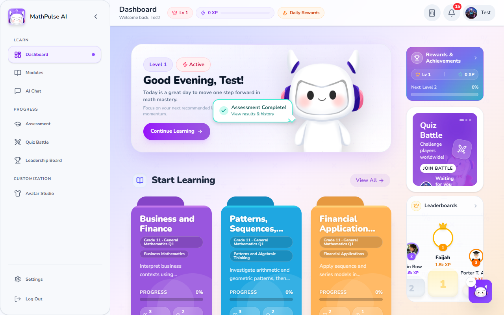
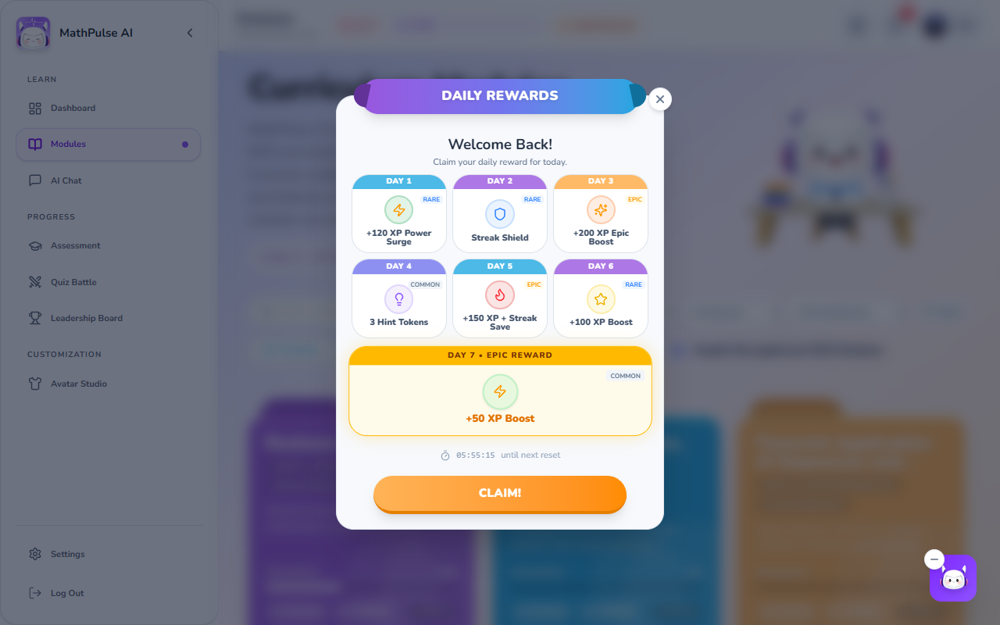
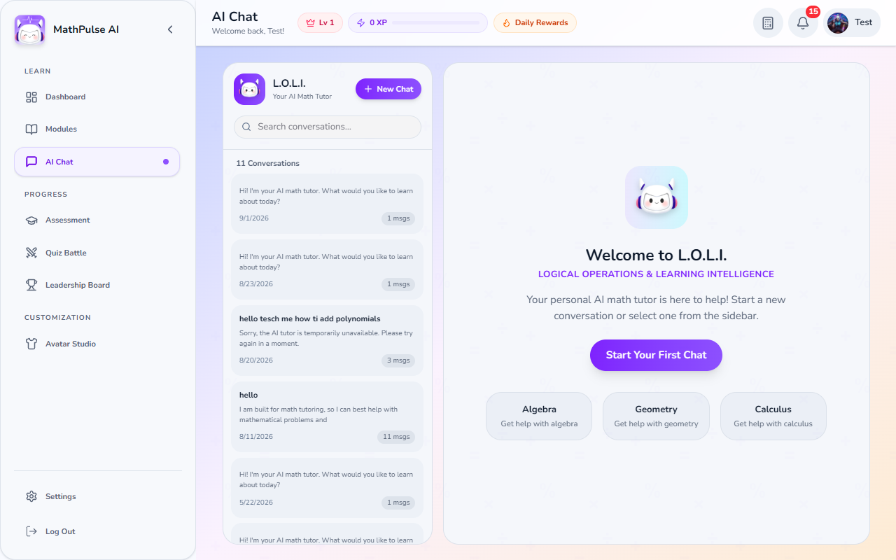
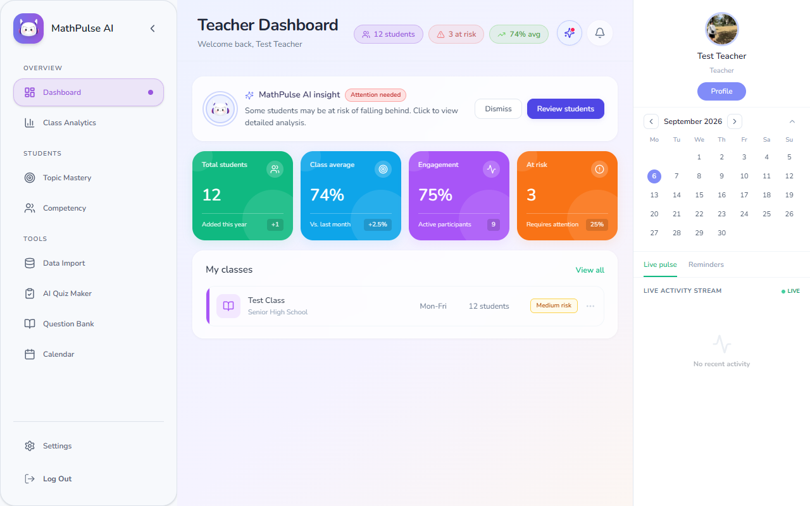
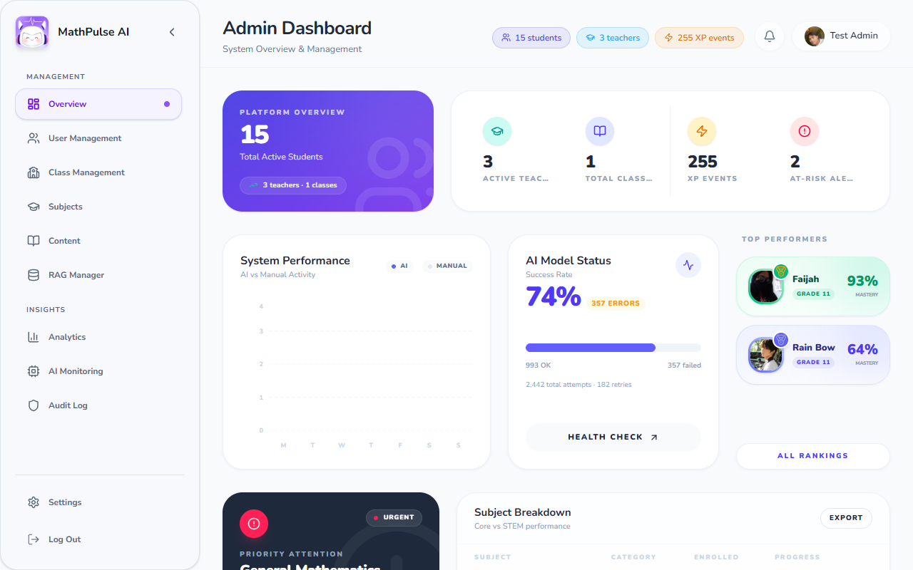

<p align="center">
  
</p>

<h1 align="center">MathPulse AI</h1>

<p align="center">
  <strong>The AI-powered math studio for Filipino Senior High STEM.</strong><br/>
  Personalized lessons. AI tutor. Quiz battles. Real-time class analytics.<br/>
  Installable PWA + native Android, running on Firebase.
</p>

<p align="center">
  <a href="https://mathpulse-ai-2026.web.app">
    
  </a>
  <a href="https://github.com/Deign86/MATHPULSE-AI/releases/tag/v1.0.0-android">
    
  </a>
  <a href="docs/PWA.md">
    
  </a>
  <a href="LICENSE">
    
  </a>
</p>

<p align="center">
  <a href="https://react.dev">
    
  </a>
  <a href="https://www.typescriptlang.org">
    
  </a>
  <a href="https://capacitorjs.com">
    
  </a>
  <a href="https://firebase.google.com">
    
  </a>
  <a href="https://fastapi.tiangolo.com">
    
  </a>
  <a href="https://vitejs.dev">
    
  </a>
  <a href="https://tailwindcss.com">
    
  </a>
  <a href="https://deepseek.com">
    
  </a>
</p>

<p align="center">
  <a href="https://mathpulse-ai-2026.web.app">Live Demo</a> •
  <a href="docs/PWA.md">PWA</a> •
  <a href="#download">Download</a> •
  <a href="#features">Features</a> •
  <a href="#-api-reference">API</a> •
  <a href="#-contributing">Contributing</a>
</p>

<br/>

<p align="center">
  <a href="https://mathpulse-ai-2026.web.app">
    
  </a>
</p>

<p align="center">
  <em>Click the image above to open the live app on <a href="https://mathpulse-ai-2026.web.app">mathpulse-ai-2026.web.app</a> — sign in with a 1-click demo account, no setup required.</em>
</p>

<br/>

<p align="center">
  
</p>

<p align="center">
  
</p>

<br/>

## What is MathPulse AI?

MathPulse AI is an **installable, gamified learning platform** for SHS math — a free, repository-owned alternative to generic tutoring apps, purpose-built around the **DepEd Strengthened SHS curriculum**. Students get diagnostic assessments, AI-generated study plans, RAG-grounded lessons, and a 24/7 AI tutor. Teachers get at-risk detection and class analytics. Admins get platform-wide oversight and AI cost monitoring.

- **Curriculum-first** — modules load directly from DepEd SHS guides (General Math, Business Math, Statistics & Probability); RAG lesson generation cites real teaching-module sources
- **L.O.L.I. AI tutor** — Logical Operations & Learning Intelligence, powered by DeepSeek with streaming, continuation repair, and KaTeX math rendering
- **Gamified to the core** — XP, exponential leveling, 7-day reward cycles, streaks, 12+ achievements, Quiz Battle PvP, leaderboards
- **Three role studios** — student, teacher, and admin dashboards, each with its own sidebar, metrics, and tools
- **Runs anywhere** — installable PWA (offline-capable), native Android APK via Capacitor, Docker self-host

---

## Try it live

No install, no keys. Open the deploy and pick a demo account:

| Account | 1-Click login | Lands on |
| ------- | ------------- | -------- |
| **Student** | `teststudent@school.edu` | Dashboard, Curriculum Modules, L.O.L.I. chat, Quiz Battle, Leaderboards |
| **Teacher** | `testteacher@school.edu` | Class dashboard (12 students, at-risk flags), Class Analytics, AI Quiz Maker, Data Import |
| **Admin** | `testadmin@school.edu` | Platform overview, User/Class Management, RAG Manager, AI Monitoring, Audit Log |

> **[Open the live app →](https://mathpulse-ai-2026.web.app)**
>
> Screenshots in this README were captured from that deploy with Chrome DevTools (`docs/screenshots/`, re-capture anytime with `node scripts/capture-readme-screenshots.mjs`).

---

## Download

| Platform | Download |
| -------- | -------- |
| Web / PWA (any device) | [Open live app](https://mathpulse-ai-2026.web.app), then **Install** from the browser or in-app install button |
| Android | [Download APK](https://github.com/Deign86/MATHPULSE-AI/releases/tag/v1.0.0-android) (`MathPulse-AI-debug.apk`) |
| Self-host | `docker compose up` (frontend `:3000` + backend `:8000`) |

> **[View all binaries →](https://github.com/Deign86/MATHPULSE-AI/releases)**
>
> **Android details** — Firebase-native (Auth, Firestore, Realtime DB), adaptive launcher icon, hardware back-button handling, edge-to-edge safe-area layout. Full guide: [Android Setup & Release Guide](docs/ANDROID_APK_SETUP.md).
>
> **PWA details** — versioned app-shell service worker, offline fallback, conservative caching (no auth/API caching), iOS Add-to-Home-Screen guidance. Full guide: [PWA docs](docs/PWA.md).

---

## Features

### Student studio

Gamified home base: hero greeting with Continue Learning, Start Learning module cards with progress, Competency Matrix radar, Rewards & Achievements, Quiz Battle entry, and live Leaderboards — with the floating L.O.L.I. tutor one tap away.

- **Diagnostic Assessments** — skill-level evaluation on first login; at-risk subjects shape the whole journey
- **Personalized Learning Paths** — AI-generated study plans built from weaknesses and priority topics
- **Curriculum Modules** — DepEd-aligned lessons and quizzes with source citations, search, and subject/quarter/competency filters
- **L.O.L.I. AI Chat Tutor** — DeepSeek-powered help with smart streaming, continuation detection, completion repair, think-tag stripping, and offline fallback answers
- **Quiz Battle** — real-time PvP matchmaking over Firebase Realtime Database
- **Daily Rewards** — 7-day claim cycle (XP boosts, streak shields, hint tokens) with Firestore streak tracking
- **Gamification** — XP, exponential levels, streaks, 12+ achievements, animated XP toasts, global + section leaderboards
- **Grades, Tasks, Profile, Avatar Studio** — grade breakdowns, kanban task board, editable profile, unlockable avatar gear
- **Notifications & Settings** — real-time Firestore notification center, personal preferences, scientific calculator (`Alt+K`)

### Teacher studio

<p align="center">
  
</p>

Mission control for a class: headcount, class average, engagement, and at-risk counts up top; AI insight banner calling out students falling behind; class cards with risk badges; calendar + live activity stream on the rail.

- **Teacher Dashboard** — 12-student overview with AI-generated daily insight and review-student shortcut
- **Risk Classification** — dual pipeline: DeepSeek structured-output labels + supervised XGBoost/RandomForest scoring with SHAP explanations
- **Class Analytics & Topic Mastery** — per-student and class-wide metrics, topic performance views, competency tracking
- **AI Quiz Maker & Question Bank** — import-grounded generation from uploaded class materials
- **Smart Data Import** — CSV/Excel/PDF class records with AI column detection
- **Task Assignment & Calendar** — create assignments, track them on the class calendar

### Admin studio

<p align="center">
  
</p>

Platform-wide command deck: active students/teachers/classes, XP event volume, at-risk alerts, AI-vs-manual activity chart, model success-rate monitor with health check, top-performer mastery cards, and subject breakdowns.

- **Platform Overview** — students, teachers, classes, XP events, at-risk alerts at a glance
- **User & Class Management** — create, edit, and manage accounts across all roles
- **Content & RAG Manager** — administer curriculum content; upload/reingest PDFs into the Chroma vector store
- **AI Monitoring** — DeepSeek success rate, error counts, retries, per-model cost tracking; runtime profile switching (`dev` / `budget` / `prod`) without redeploys
- **Audit Log & System Settings** — severity-tagged admin action log, feature flags, maintenance mode

### AI models (current runtime)

| Model | Primary use |
| ----- | ----------- |
| **deepseek-chat** | Global default: chat, verification, lesson/quiz generation, learning paths, daily insights, risk classification |
| **deepseek-reasoner** | Extended reasoning for complex RAG and curriculum search tasks |

Runtime routing (`backend/services/inference_client.py`) dispatches with fallback chains; profiles switchable live from the admin panel. Risk also has a supervised ML path (XGBoost/RandomForest, `models/risk_classifier.joblib`, trained via `/api/predict-risk/train-model`).

---

## Tech Stack

### Frontend

| Technology | Version | Purpose |
| ---------- | ------- | ------- |
| **React** | 18.3.1 | UI framework, functional components + hooks |
| **TypeScript** | 5.9.3 | Strict-mode type safety, discriminated role types |
| **Capacitor** | 7.1.2 | Native Android/iOS bridge |
| **Vite** | 6.3.5 | Dev server, HMR, optimized builds |
| **Tailwind CSS** | 4.1.18 | Utility-first styling via `@tailwindcss/vite` |
| **Radix UI** | Latest | 48+ accessible component primitives |
| **Motion** | 12.38 | Animations, layout transitions |
| **Recharts** | 2.15.4 | Charts and analytics visuals |
| **KaTeX** | Latest | Math rendering (global CSS, tolerant parsing) |
| **Zustand / TanStack Query** | Latest / 5 | Client state / server state |

### Backend & AI

| Technology | Purpose |
| ---------- | ------- |
| **FastAPI + Uvicorn** | 64-route Python API with OpenAPI docs, CORS, rate limiting |
| **DeepSeek API** | Inference via OpenAI-compatible client (`prod` profile: reasoner for RAG, chat elsewhere) |
| **Chroma + `BAAI/bge-small-en-v1.5`** | Curriculum vector store (`datasets/vectorstore/`, `curriculum_chunks` collection) |
| **LiteParse** | Local PDF/document parsing for ingestion and uploads |
| **XGBoost / scikit-learn** | Supervised risk classification with SHAP explanations |

### Infrastructure

| Technology | Purpose |
| ---------- | ------- |
| **Firebase Auth** | Email/password + Google OAuth (`mathpulse-ai-2026`) |
| **Cloud Firestore** | All app data (users, progress, XP, chats, notifications) |
| **Realtime Database** | Quiz Battle matchmaking queue |
| **Firebase Hosting** | Production PWA hosting, SPA rewrites, PWA cache headers |
| **Cloud Functions (Node 22)** | Diagnostic processing, risk analysis, notifications, XP scoring |
| **Docker / Nginx** | Self-hosted production alternative |

---

## Getting Started

### Prerequisites

- **Node.js** ≥ 18 · **npm** ≥ 9 · **Python** ≥ 3.10
- A **Firebase** project ([console](https://console.firebase.google.com/))
- A **DeepSeek API key** ([platform.deepseek.com](https://platform.deepseek.com))

### Installation

1. **Clone the repository**
   ```bash
   git clone https://github.com/Deign86/MATHPULSE-AI.git
   cd MATHPULSE-AI
   ```

2. **Install frontend dependencies**
   ```bash
   npm install
   ```

3. **Configure environment variables** — create `.env.local`:
   ```env
   # Firebase (required)
   VITE_FIREBASE_API_KEY=your_api_key
   VITE_FIREBASE_AUTH_DOMAIN=your_project.firebaseapp.com
   VITE_FIREBASE_PROJECT_ID=your_project_id
   VITE_FIREBASE_STORAGE_BUCKET=your_project.appspot.com
   VITE_FIREBASE_MESSAGING_SENDER_ID=your_sender_id
   VITE_FIREBASE_APP_ID=your_app_id

   # DeepSeek API (required for AI features)
   DEEPSEEK_API_KEY=your_deepseek_api_key
   DEEPSEEK_BASE_URL=https://api.deepseek.com

   # Backend API (optional — defaults to same-origin /api)
   VITE_API_URL=/api
   VITE_APP_VERSION=1.0.0

   # Import-grounded generation flags (frontend)
   VITE_ENABLE_IMPORT_GROUNDED_QUIZ=true
   VITE_ENABLE_IMPORT_GROUNDED_LESSON=true
   VITE_ENABLE_IMPORT_GROUNDED_FEEDBACK_EVENTS=true
   VITE_ENABLE_ASYNC_GENERATION=true
   ```

4. **Start the frontend dev server**
   ```bash
   npm run dev
   ```
   Opens at `http://localhost:5173`.

5. **Set up the backend** (optional, for AI features)
   ```bash
   cd backend
   pip install -r requirements.txt
   export DEEPSEEK_API_KEY=your_deepseek_api_key
   uvicorn main:app --reload --host 0.0.0.0 --port 7860
   ```
   > Set `VITE_API_URL=http://127.0.0.1:8000` when running FastAPI separately, or keep `/api` behind the Docker/Nginx proxy.

### Build & deploy

```bash
npm run build                        # → build/
npx firebase deploy --only hosting   # PWA → Firebase Hosting
```

### Backend regression gate

```bash
npm run check:backend         # pytest + mypy
npm run check:backend:dev     # mypy only (fast, runs on predev)
npm run check:backend:quick   # critical test file only
```

---

## Architecture

Mapped as a knowledge graph with **GitNexus** — 573 source files, 16,882 symbols, 26,955 relationships, 580 functional communities, 300 execution-flow chains. Deepest call chains (7–8 steps) run UI → API service → backend route → AI inference → Firestore.

| Metric | Value |
| ------ | ----- |
| Source files | 573 |
| Code symbols | 16,882 |
| Symbol relationships | 26,955 |
| Functional communities | 580 |
| Execution flow chains | 300 |

**Key patterns** — service-layer abstraction (components never touch Firestore directly), discriminated role types (`StudentProfile | TeacherProfile | AdminProfile`), `AuthContext`/`ChatContext` + `onSnapshot` realtime listeners, async task queue for heavy generation (`POST /api/lesson|quiz/generate-async` → `GET /api/tasks/{id}`).

**Firestore collections** — `users/` (role-discriminated), `progress/`, `xpActivities/`, `achievements/`, `notifications/`, `tasks/`, `chatSessions/`, `chatMessages/`.

**Cloud Functions** (`functions/src/`) — diagnostic orchestration, rule-based risk analysis, notification fan-out, remedial quiz building, learning-path engine, IAR scoring, reassessment. **Pre-deploy gates** (`pre_deploy_check.py`, `startup_validation.py`) verify imports, env vars, config parsing, and inference-client init.

```
MATHPULSE-AI/
├── src/                  # React frontend (components, services, stores, data, features)
├── backend/              # FastAPI (routes/, rag/, services/, tests/)
├── functions/            # Cloud Functions (automations, triggers, scoring)
├── android/              # Capacitor native wrapper
├── datasets/             # DepEd SSHS corpus + Chroma vector store
├── scripts/              # Gates, seeds, model sync, screenshot capture
├── docs/                 # PWA, Android, contracts — plus docs/screenshots/
├── docker-compose.yml  / Dockerfile / nginx.conf / firebase.json
```

---

## 📡 API Reference

The FastAPI backend exposes **64 routes** across 15+ modules (interactive docs at `/docs` or `/redoc` when running):

| Route Module | Routes | Domain |
| ------------ | ------ | ------ |
| `rag_routes.py` | 8 | RAG lesson generation, health, document management |
| `class_analytics_routes.py` | 6 | Class analytics, student views, topic performance |
| `class_records_router.py` | 6 | SHS record upload, AI column detection, reports |
| `pipeline_routes.py` | 5 | Student intelligence pipeline, nudges, recompute |
| `admin_routes.py` | 4 | Admin PDF upload/reingest, school analytics |
| `intervention_routes.py` | 3 | Intervention plans, stepped guides, PDF export |
| `deepseek_rag_routes.py` | 3 | Weakness detection, module previews, study tips |
| `quiz_battle.py` | 3 | Quiz battle ingestion, bank status, results |
| `practice.py` | 3 | Practice generation, submission, stats, history |
| `diagnostic.py` | 1 | Full diagnostic + RAG analysis |
| `risk_router.py` | 2 | Risk computation (single + batch) |
| `quiz_generation_routes.py` | 1 | AI quiz generation |
| `ai_monitoring.py` | 2 | DeepSeek monitoring + cost tracking |

| Method | Endpoint | Description |
| ------ | -------- | ----------- |
| `GET` | `/health` | Health check with model status |
| `POST` | `/api/chat` / `/api/chat/stream` | AI tutor conversation (SSE streaming) |
| `POST` | `/api/verify-solution` | Multi-method math solution verification |
| `POST` | `/api/predict-risk` | Risk classification (DeepSeek structured output) |
| `POST` | `/api/predict-risk/enhanced` | ML risk scoring + LLM interventions |
| `POST` | `/api/learning-path` | Personalized path from weaknesses |
| `POST` | `/api/analytics/daily-insight` | Daily teacher-dashboard insights |
| `POST` | `/api/lesson/generate` | Import-grounded lesson plans |
| `POST` | `/api/quiz/generate` | Curriculum/grounded quiz sets |
| `POST` | `/api/lesson|quiz/generate-async` | Async generation → `{ taskId }` |
| `GET` | `/api/tasks/{task_id}` | Poll async task status/result |
| `POST` | `/api/upload/class-records` | CSV/XLSX/PDF upload + AI column detection |
| `POST` | `/api/automation/diagnostic-completed` | Post-diagnostic workflow trigger |
| `GET` | `/api/admin/model-config` | Model config + profiles |
| `POST` | `/api/admin/model-config/profile` | Switch profile (`dev`/`budget`/`prod`) |

**Math verification pipeline** — self-consistency (3 samples, agreement-scored), sandboxed Python code verification, and a low-temperature LLM judge.

---

## Gamification System

| Feature | Details |
| ------- | ------- |
| **XP Rewards** | Fixed XP per action (e.g., 50 XP per lesson) |
| **Daily Check-In** | 7-day cycle, escalating XP (20 → 100 XP) + streak bonuses |
| **Leveling** | Exponential curve: `XP_needed = 100 × 1.5^(level − 1)` |
| **Streaks** | Daily login tracking (5 XP × streak days, max 50) |
| **Achievements** | 12+ unlockable milestones |
| **Leaderboard** | Global and section-based rankings |

---

## 🐳 Docker

```bash
docker compose up                 # dev: hot reload frontend + backend
docker compose --profile prod up  # prod: Nginx serving optimized build
docker compose down               # stop
```

| Service | Port | Description |
| ------- | ---- | ----------- |
| Frontend (dev) | `3000` | Vite dev server |
| Backend | `8000` | FastAPI (container `:7860`) |
| Production | `80` | Nginx production build |

---

## 🤝 Contributing

1. Fork the repository
2. Create a feature branch (`git checkout -b feature/amazing-feature`)
3. Commit your changes (`git commit -m 'Add amazing feature'`)
4. Push to the branch (`git push origin feature/amazing-feature`)
5. Open a Pull Request

**Conventions** — PascalCase components in `src/components/`, camelCase services in `src/services/`, shared types in `src/types/models.ts`, Tailwind utilities (mobile-first), all API calls through `src/services/apiService.ts` + `src/config/env.ts`.

---

## 📄 License

MIT — see [LICENSE](LICENSE).

## 👥 Authors

- **Deign86** — [GitHub](https://github.com/Deign86)

---

<div align="center">
  <sub>Built with ❤️ for math education · Screenshots from the <a href="https://mathpulse-ai-2026.web.app">live deploy</a></sub>
</div>
