# MathPulse AI — Modular Activity Diagrams Specification

> **Document Type:** Activity Diagrams Architecture & Defense Specification  
> **Target Standard:** Capstone Defense SAD, UML Swimlane Activity Specification & Professor Compliance  
> **Repository Location:** `docs/ACTIVITY_DIAGRAMS.md`

---

## 1. Executive Summary & Module Alignment

This document specifies the official **UML Swimlane Activity Diagrams** for MathPulse AI across the **9 Core System Modules**. In accordance with UML standards, these activity diagrams focus purely on **user action flows, operational logic, decision points, and cross-lane transactions** (data stores are documented separately in the Data Flow Diagrams).

| Module # | Official Module Name | Dominant User (Left Swimlane) | Secondary Actors |
|:---:|---|---|---|
| **1** | **User Authentication & Accounts** | **Student** | **Teacher**, **Administrator**, System |
| **2** | **Academic Classroom Management** | **Teacher** | **Student**, System |
| **3** | **Curriculum & Content Management** | **Teacher / Admin** | System |
| **4** | **Diagnostic Assessment & Path** | **Student** | System |
| **5** | **Quiz Creation & Examination** | **Student** *(Exam)* / **Teacher** *(Creation)* | System |
| **6** | **Learning Progress & Gamification** | **Student** | System |
| **7** | **Real-Time Quiz Battle** | **Student** | System (RTDB) |
| **8** | **Remedial Intervention & Risk** | **Teacher** | **Student**, System |
| **9** | **System Audit & AI Tutoring** | **Student** *(Chat)* | **Administrator** *(Audit)*, System |

> 🌐 **Interactive Swimlane Viewer:** Open [`docs/activity-diagrams-viewer.html`](activity-diagrams-viewer.html) in your browser for interactive zoom/pan and vector SVG / high-resolution PNG export.  
> 📁 **Rendered Swimlane Images Directory:** [`docs/diagrams/activity_diagrams/`](diagrams/activity_diagrams/)

---

## 2. Diagramming Standards Checklist

- [x] **One activity diagram per main module:** Exactly 9 modular diagrams matching Modules 1 through 9.
- [x] **Dominant User on Left Swimlane:** The primary user is placed in the leftmost column (`Student` on student modules; `Teacher` on class/remedial modules).
- [x] **Strict UML Swimlane Partitions:** Parallel vertical columns with clean horizontal interaction arrows.
- [x] **Pure UML Activity Semantics:** No DFD data store labels inside activity nodes.
- [x] **Solid Circle `((●))`:** Used exclusively for Start points.
- [x] **Circle with "X" `((X))`:** Used exclusively for Exit / Transaction Completion.
- [x] **Arrow pointing to "N" `((N))`:** Used exclusively for Cancelled / Aborted transactions.
- [x] **No Stretched Symbols:** Uniform node sizes and crisp decision diamonds.

---

## 3. The 9 Modular Activity Diagrams (Swimlane Architecture)

### Module 1: User Authentication & Accounts

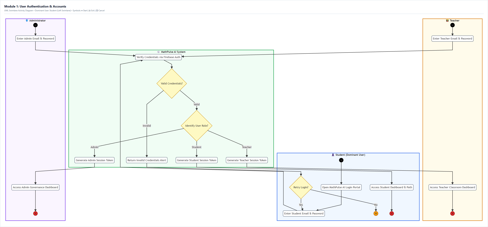
*Files: [Download Vector SVG](diagrams/activity_diagrams/mod1_user_authentication_accounts.svg) • [Download PNG](diagrams/activity_diagrams/mod1_user_authentication_accounts.png)*

> **Swimlane Configuration:**
> - **Left Swimlane (Dominant User):** `Student (Left Swimlane)`
> - **Middle/Right Swimlanes:** `MathPulse AI System` (and secondary actors where applicable)
> - **UML Symbols:** Solid Circle `((●))` = Start • Red Circle `((X))` = Exit • Orange Circle `((N))` = Cancel

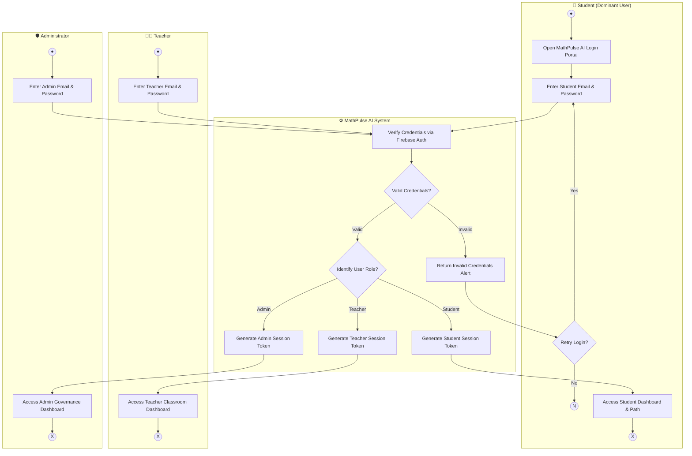
```mermaid
flowchart TD
    subgraph Student["👤 Student (Dominant User)"]
        direction TB
        M1_Start((●)) --> M1_S_Open["Open MathPulse AI Login Portal"]
        M1_S_Open --> M1_S_Input["Enter Student Email & Password"]
        M1_S_Retry{"Retry Login?"}
        M1_S_Retry -- "No" --> M1_S_Cancel((N))
        M1_S_Retry -- "Yes" --> M1_S_Input
        M1_S_Dash["Access Student Dashboard & Path"] --> M1_S_End((X))
    end

    subgraph System["⚙️ MathPulse AI System"]
        direction TB
        M1_Sys_Verify["Verify Credentials via Firebase Auth"]
        M1_Sys_AuthCheck{"Valid Credentials?"}
        M1_Sys_Err["Return Invalid Credentials Alert"]
        M1_Sys_Role{"Identify User Role?"}
        M1_Sys_StudentSession["Generate Student Session Token"]
        M1_Sys_TeacherSession["Generate Teacher Session Token"]
        M1_Sys_AdminSession["Generate Admin Session Token"]
    end

    subgraph Teacher["👨‍🏫 Teacher"]
        direction TB
        M1_T_Start((●)) --> M1_T_Input["Enter Teacher Email & Password"]
        M1_T_Dash["Access Teacher Classroom Dashboard"] --> M1_T_End((X))
    end

    subgraph Admin["🛡️ Administrator"]
        direction TB
        M1_A_Start((●)) --> M1_A_Input["Enter Admin Email & Password"]
        M1_A_Dash["Access Admin Governance Dashboard"] --> M1_A_End((X))
    end

    M1_S_Input --> M1_Sys_Verify
    M1_T_Input --> M1_Sys_Verify
    M1_A_Input --> M1_Sys_Verify

    M1_Sys_Verify --> M1_Sys_AuthCheck
    M1_Sys_AuthCheck -- "Invalid" --> M1_Sys_Err
    M1_Sys_Err --> M1_S_Retry

    M1_Sys_AuthCheck -- "Valid" --> M1_Sys_Role
    M1_Sys_Role -- "Student" --> M1_Sys_StudentSession
    M1_Sys_Role -- "Teacher" --> M1_Sys_TeacherSession
    M1_Sys_Role -- "Admin" --> M1_Sys_AdminSession

    M1_Sys_StudentSession --> M1_S_Dash
    M1_Sys_TeacherSession --> M1_T_Dash
    M1_Sys_AdminSession --> M1_A_Dash
```

---

### Module 2: Academic Classroom Management

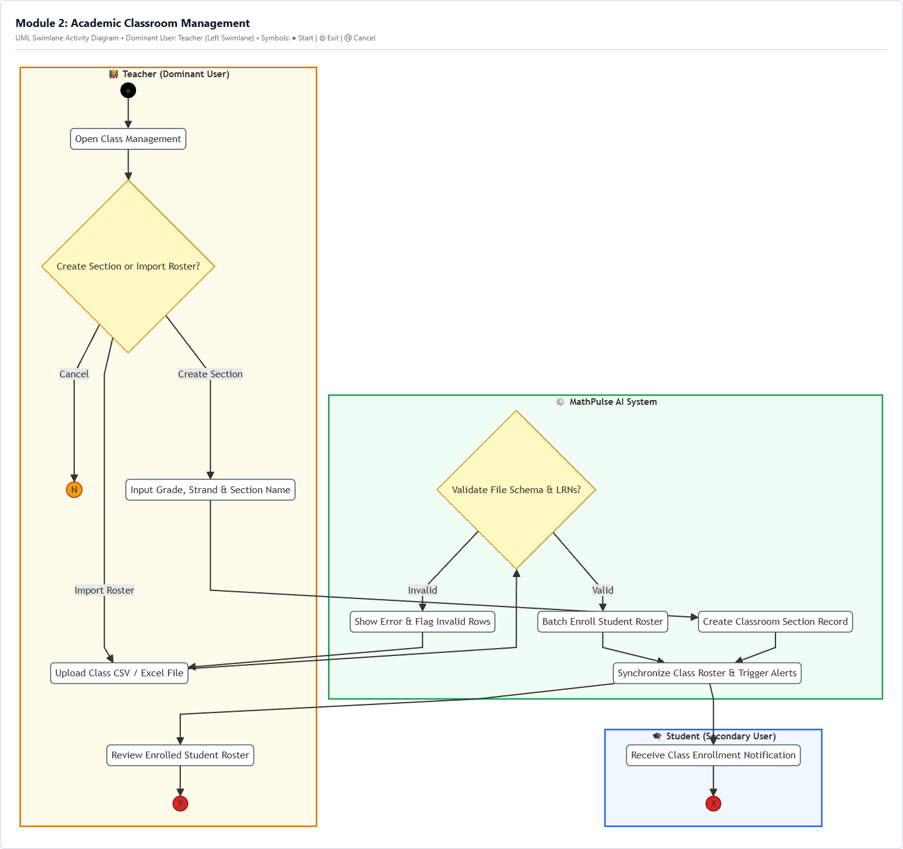
*Files: [Download Vector SVG](diagrams/activity_diagrams/mod2_academic_classroom_management.svg) • [Download PNG](diagrams/activity_diagrams/mod2_academic_classroom_management.png)*

> **Swimlane Configuration:**
> - **Left Swimlane (Dominant User):** `Teacher (Left Swimlane)`
> - **Middle/Right Swimlanes:** `MathPulse AI System` (and secondary actors where applicable)
> - **UML Symbols:** Solid Circle `((●))` = Start • Red Circle `((X))` = Exit • Orange Circle `((N))` = Cancel

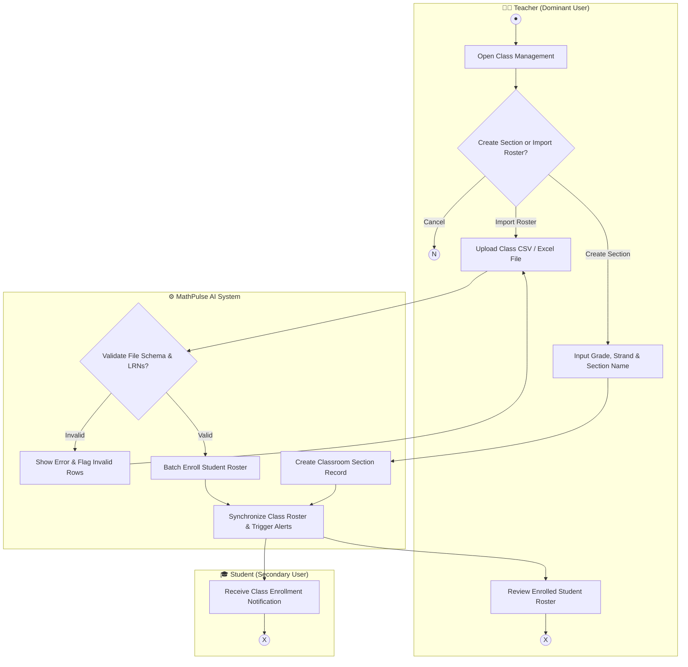
```mermaid
flowchart TD
    subgraph Teacher["👨‍🏫 Teacher (Dominant User)"]
        direction TB
        M2_Start((●)) --> M2_OpenClass["Open Class Management"]
        M2_OpenClass --> M2_SelectAction{"Create Section or Import Roster?"}
        M2_SelectAction -- "Cancel" --> M2_Cancel((N))
        M2_SelectAction -- "Import Roster" --> M2_UploadCSV["Upload Class CSV / Excel File"]
        M2_SelectAction -- "Create Section" --> M2_InputSection["Input Grade, Strand & Section Name"]
        M2_Review["Review Enrolled Student Roster"] --> M2_End((X))
    end

    subgraph System["⚙️ MathPulse AI System"]
        direction TB
        M2_ValidateFile{"Validate File Schema & LRNs?"}
        M2_FileErr["Show Error & Flag Invalid Rows"]
        M2_BatchEnroll["Batch Enroll Student Roster"]
        M2_CreateSection["Create Classroom Section Record"]
        M2_Sync["Synchronize Class Roster & Trigger Alerts"]
    end

    subgraph Student["🎓 Student (Secondary User)"]
        direction TB
        M2_NotifyStudent["Receive Class Enrollment Notification"]
        M2_StudentEnd((X))
    end

    M2_UploadCSV --> M2_ValidateFile
    M2_ValidateFile -- "Invalid" --> M2_FileErr
    M2_FileErr --> M2_UploadCSV
    M2_ValidateFile -- "Valid" --> M2_BatchEnroll
    M2_InputSection --> M2_CreateSection
    M2_BatchEnroll --> M2_Sync
    M2_CreateSection --> M2_Sync
    M2_Sync --> M2_Review
    M2_Sync --> M2_NotifyStudent
    M2_NotifyStudent --> M2_StudentEnd
```

---

### Module 3: Curriculum & Content Management

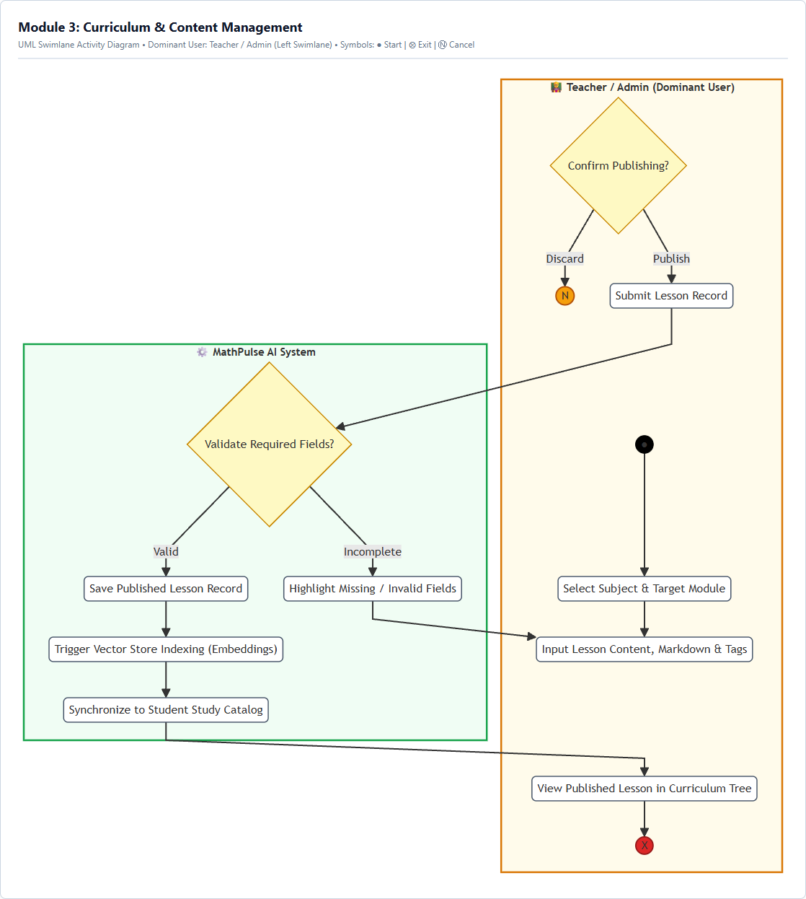
*Files: [Download Vector SVG](diagrams/activity_diagrams/mod3_curriculum_content_management.svg) • [Download PNG](diagrams/activity_diagrams/mod3_curriculum_content_management.png)*

> **Swimlane Configuration:**
> - **Left Swimlane (Dominant User):** `Teacher / Admin (Left Swimlane)`
> - **Middle/Right Swimlanes:** `MathPulse AI System` (and secondary actors where applicable)
> - **UML Symbols:** Solid Circle `((●))` = Start • Red Circle `((X))` = Exit • Orange Circle `((N))` = Cancel

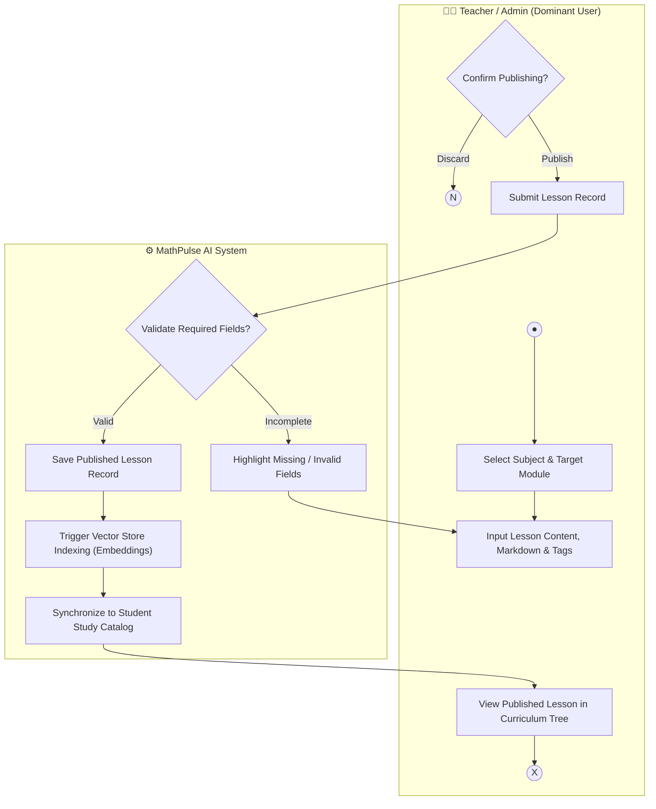
```mermaid
flowchart TD
    subgraph Author["👨‍🏫 Teacher / Admin (Dominant User)"]
        direction TB
        M3_Start((●)) --> M3_SelectTopic["Select Subject & Target Module"]
        M3_SelectTopic --> M3_DraftContent["Input Lesson Content, Markdown & Tags"]
        M3_PublishCheck{"Confirm Publishing?"}
        M3_PublishCheck -- "Discard" --> M3_Cancel((N))
        M3_PublishCheck -- "Publish" --> M3_SubmitLesson["Submit Lesson Record"]
        M3_ViewPublished["View Published Lesson in Curriculum Tree"] --> M3_End((X))
    end

    subgraph System["⚙️ MathPulse AI System"]
        direction TB
        M3_ValidateContent{"Validate Required Fields?"}
        M3_ShowErr["Highlight Missing / Invalid Fields"]
        M3_SaveDB["Save Published Lesson Record"]
        M3_RAGIndex["Trigger Vector Store Indexing (Embeddings)"]
        M3_SyncCatalog["Synchronize to Student Study Catalog"]
    end

    M3_SubmitLesson --> M3_ValidateContent
    M3_ValidateContent -- "Incomplete" --> M3_ShowErr
    M3_ShowErr --> M3_DraftContent
    M3_ValidateContent -- "Valid" --> M3_SaveDB
    M3_SaveDB --> M3_RAGIndex
    M3_RAGIndex --> M3_SyncCatalog
    M3_SyncCatalog --> M3_ViewPublished
```

---

### Module 4: Diagnostic Assessment & Path

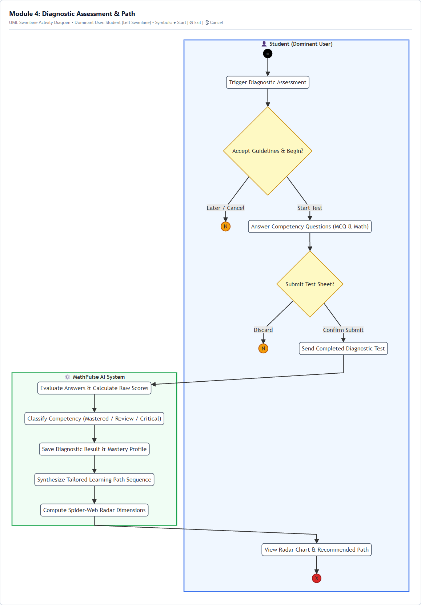
*Files: [Download Vector SVG](diagrams/activity_diagrams/mod4_diagnostic_assessment_path.svg) • [Download PNG](diagrams/activity_diagrams/mod4_diagnostic_assessment_path.png)*

> **Swimlane Configuration:**
> - **Left Swimlane (Dominant User):** `Student (Left Swimlane)`
> - **Middle/Right Swimlanes:** `MathPulse AI System` (and secondary actors where applicable)
> - **UML Symbols:** Solid Circle `((●))` = Start • Red Circle `((X))` = Exit • Orange Circle `((N))` = Cancel

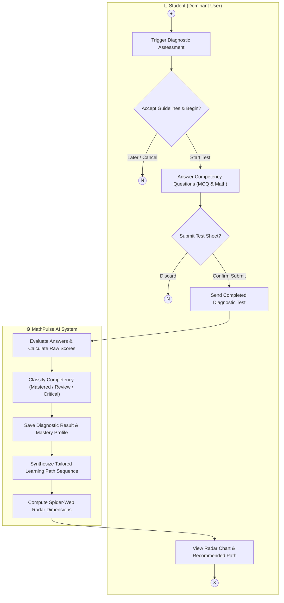
```mermaid
flowchart TD
    subgraph Student["👤 Student (Dominant User)"]
        direction TB
        M4_Start((●)) --> M4_LaunchModal["Trigger Diagnostic Assessment"]
        M4_LaunchModal --> M4_StartCheck{"Accept Guidelines & Begin?"}
        M4_StartCheck -- "Later / Cancel" --> M4_Cancel((N))
        M4_StartCheck -- "Start Test" --> M4_AnswerItems["Answer Competency Questions (MCQ & Math)"]
        M4_AnswerItems --> M4_SubmitCheck{"Submit Test Sheet?"}
        M4_SubmitCheck -- "Discard" --> M4_CancelTest((N))
        M4_SubmitCheck -- "Confirm Submit" --> M4_SendSheet["Send Completed Diagnostic Test"]
        M4_ViewPath["View Radar Chart & Recommended Path"] --> M4_End((X))
    end

    subgraph System["⚙️ MathPulse AI System"]
        direction TB
        M4_Grade["Evaluate Answers & Calculate Raw Scores"]
        M4_Classify["Classify Competency (Mastered / Review / Critical)"]
        M4_SaveResult["Save Diagnostic Result & Mastery Profile"]
        M4_GenPath["Synthesize Tailored Learning Path Sequence"]
        M4_RenderRadar["Compute Spider-Web Radar Dimensions"]
    end

    M4_SendSheet --> M4_Grade
    M4_Grade --> M4_Classify
    M4_Classify --> M4_SaveResult
    M4_SaveResult --> M4_GenPath
    M4_GenPath --> M4_RenderRadar
    M4_RenderRadar --> M4_ViewPath
```

---

### Module 5: Quiz Creation & Examination

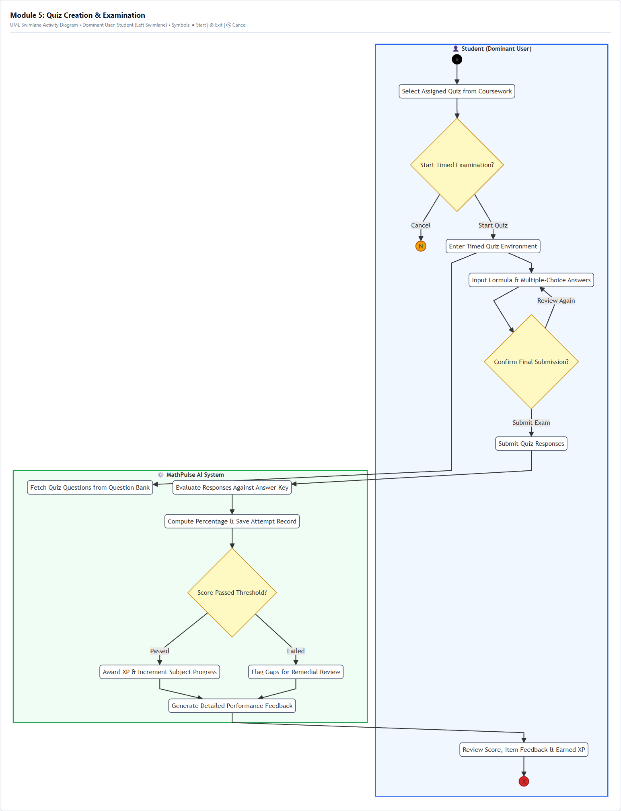
*Files: [Download Vector SVG](diagrams/activity_diagrams/mod5_quiz_creation_examination.svg) • [Download PNG](diagrams/activity_diagrams/mod5_quiz_creation_examination.png)*

> **Swimlane Configuration:**
> - **Left Swimlane (Dominant User):** `Student (Left Swimlane)`
> - **Middle/Right Swimlanes:** `MathPulse AI System` (and secondary actors where applicable)
> - **UML Symbols:** Solid Circle `((●))` = Start • Red Circle `((X))` = Exit • Orange Circle `((N))` = Cancel

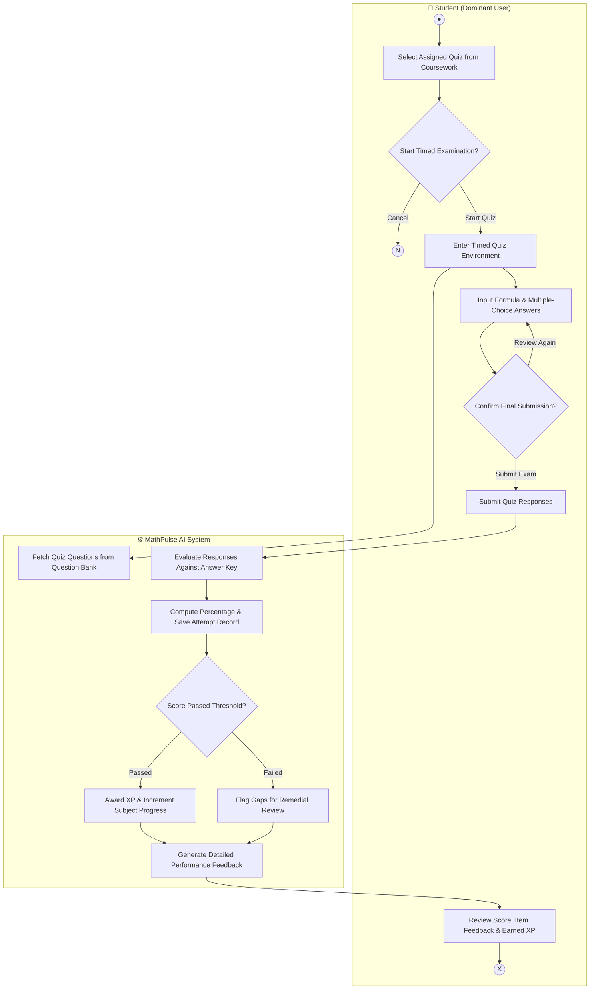
```mermaid
flowchart TD
    subgraph Student["👤 Student (Dominant User)"]
        direction TB
        M5_Start((●)) --> M5_SelectQuiz["Select Assigned Quiz from Coursework"]
        M5_SelectQuiz --> M5_StartPrompt{"Start Timed Examination?"}
        M5_StartPrompt -- "Cancel" --> M5_Cancel((N))
        M5_StartPrompt -- "Start Quiz" --> M5_EnterExam["Enter Timed Quiz Environment"]
        M5_EnterExam --> M5_AnswerItems["Input Formula & Multiple-Choice Answers"]
        M5_AnswerItems --> M5_ConfirmSubmit{"Confirm Final Submission?"}
        M5_ConfirmSubmit -- "Review Again" --> M5_AnswerItems
        M5_ConfirmSubmit -- "Submit Exam" --> M5_SendExam["Submit Quiz Responses"]
        M5_ViewFeedback["Review Score, Item Feedback & Earned XP"] --> M5_End((X))
    end

    subgraph System["⚙️ MathPulse AI System"]
        direction TB
        M5_FetchQuiz["Fetch Quiz Questions from Question Bank"]
        M5_GradeAnswers["Evaluate Responses Against Answer Key"]
        M5_ComputeScore["Compute Percentage & Save Attempt Record"]
        M5_PassCheck{"Score Passed Threshold?"}
        M5_AwardXP["Award XP & Increment Subject Progress"]
        M5_FlagReview["Flag Gaps for Remedial Review"]
        M5_RenderSummary["Generate Detailed Performance Feedback"]
    end

    M5_EnterExam --> M5_FetchQuiz
    M5_SendExam --> M5_GradeAnswers
    M5_GradeAnswers --> M5_ComputeScore
    M5_ComputeScore --> M5_PassCheck
    M5_PassCheck -- "Passed" --> M5_AwardXP
    M5_PassCheck -- "Failed" --> M5_FlagReview
    M5_AwardXP --> M5_RenderSummary
    M5_FlagReview --> M5_RenderSummary
    M5_RenderSummary --> M5_ViewFeedback
```

---

### Module 6: Learning Progress & Gamification

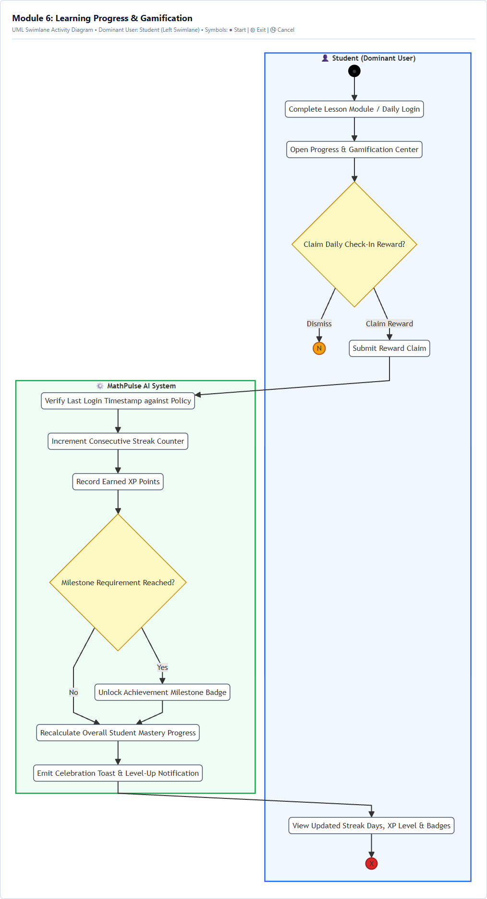
*Files: [Download Vector SVG](diagrams/activity_diagrams/mod6_learning_progress_gamification.svg) • [Download PNG](diagrams/activity_diagrams/mod6_learning_progress_gamification.png)*

> **Swimlane Configuration:**
> - **Left Swimlane (Dominant User):** `Student (Left Swimlane)`
> - **Middle/Right Swimlanes:** `MathPulse AI System` (and secondary actors where applicable)
> - **UML Symbols:** Solid Circle `((●))` = Start • Red Circle `((X))` = Exit • Orange Circle `((N))` = Cancel

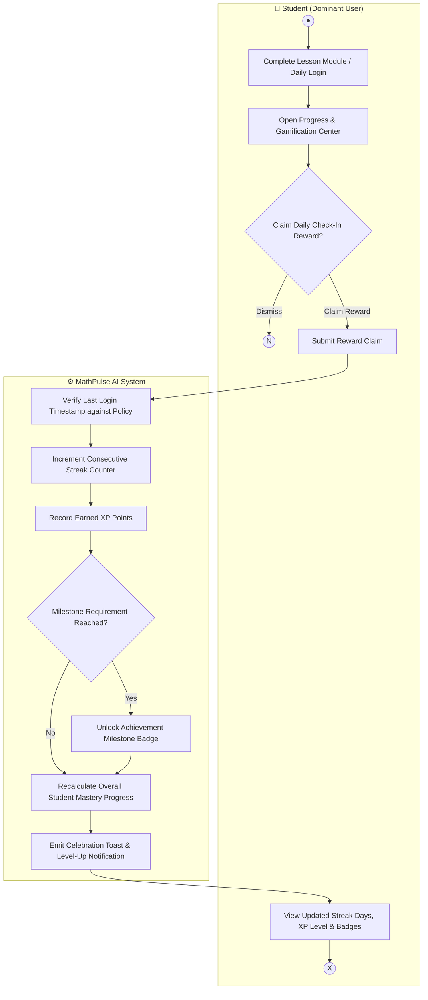
```mermaid
flowchart TD
    subgraph Student["👤 Student (Dominant User)"]
        direction TB
        M6_Start((●)) --> M6_CompleteTask["Complete Lesson Module / Daily Login"]
        M6_CompleteTask --> M6_OpenGamification["Open Progress & Gamification Center"]
        M6_OpenGamification --> M6_CheckReward{"Claim Daily Check-In Reward?"}
        M6_CheckReward -- "Dismiss" --> M6_Dismiss((N))
        M6_CheckReward -- "Claim Reward" --> M6_SendClaim["Submit Reward Claim"]
        M6_ViewStats["View Updated Streak Days, XP Level & Badges"] --> M6_End((X))
    end

    subgraph System["⚙️ MathPulse AI System"]
        direction TB
        M6_VerifyStreak["Verify Last Login Timestamp against Policy"]
        M6_UpdateStreak["Increment Consecutive Streak Counter"]
        M6_AwardXP["Record Earned XP Points"]
        M6_BadgeCheck{"Milestone Requirement Reached?"}
        M6_UnlockBadge["Unlock Achievement Milestone Badge"]
        M6_SyncOverall["Recalculate Overall Student Mastery Progress"]
        M6_EmitToast["Emit Celebration Toast & Level-Up Notification"]
    end

    M6_SendClaim --> M6_VerifyStreak
    M6_VerifyStreak --> M6_UpdateStreak
    M6_UpdateStreak --> M6_AwardXP
    M6_AwardXP --> M6_BadgeCheck
    M6_BadgeCheck -- "Yes" --> M6_UnlockBadge
    M6_BadgeCheck -- "No" --> M6_SyncOverall
    M6_UnlockBadge --> M6_SyncOverall
    M6_SyncOverall --> M6_EmitToast
    M6_EmitToast --> M6_ViewStats
```

---

### Module 7: Real-Time Quiz Battle

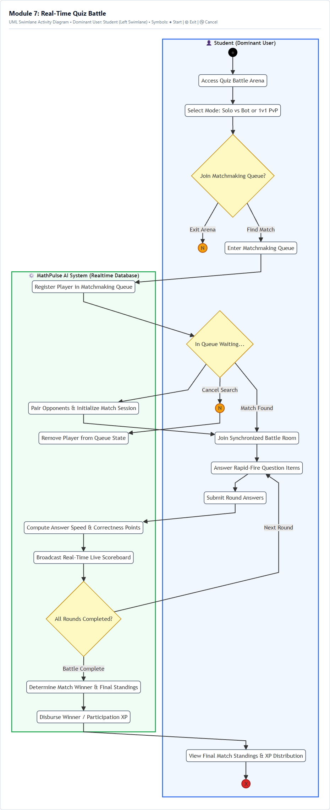
*Files: [Download Vector SVG](diagrams/activity_diagrams/mod7_real_time_quiz_battle.svg) • [Download PNG](diagrams/activity_diagrams/mod7_real_time_quiz_battle.png)*

> **Swimlane Configuration:**
> - **Left Swimlane (Dominant User):** `Student (Left Swimlane)`
> - **Middle/Right Swimlanes:** `MathPulse AI System` (and secondary actors where applicable)
> - **UML Symbols:** Solid Circle `((●))` = Start • Red Circle `((X))` = Exit • Orange Circle `((N))` = Cancel

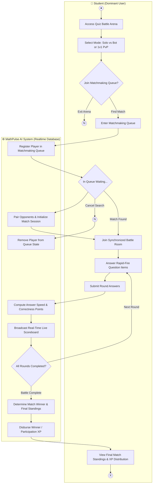
```mermaid
flowchart TD
    subgraph Student["👤 Student (Dominant User)"]
        direction TB
        M7_Start((●)) --> M7_OpenArena["Access Quiz Battle Arena"]
        M7_OpenArena --> M7_SelectMode["Select Mode: Solo vs Bot or 1v1 PvP"]
        M7_SelectMode --> M7_JoinPrompt{"Join Matchmaking Queue?"}
        M7_JoinPrompt -- "Exit Arena" --> M7_CancelArena((N))
        M7_JoinPrompt -- "Find Match" --> M7_EnterQueue["Enter Matchmaking Queue"]
        M7_WaitQueue{"In Queue Waiting..."}
        M7_WaitQueue -- "Cancel Search" --> M7_CancelQueue((N))
        M7_WaitQueue -- "Match Found" --> M7_JoinRoom["Join Synchronized Battle Room"]
        M7_JoinRoom --> M7_AnswerRound["Answer Rapid-Fire Question Items"]
        M7_AnswerRound --> M7_SubmitRound["Submit Round Answers"]
        M7_ViewResults["View Final Match Standings & XP Distribution"] --> M7_End((X))
    end

    subgraph System["⚙️ MathPulse AI System (Realtime Database)"]
        direction TB
        M7_Enqueue["Register Player in Matchmaking Queue"]
        M7_Dequeue["Remove Player from Queue State"]
        M7_Pair["Pair Opponents & Initialize Match Session"]
        M7_ScoreRound["Compute Answer Speed & Correctness Points"]
        M7_SyncScore["Broadcast Real-Time Live Scoreboard"]
        M7_RoundCheck{"All Rounds Completed?"}
        M7_ResolveWinner["Determine Match Winner & Final Standings"]
        M7_AwardBattleXP["Disburse Winner / Participation XP"]
    end

    M7_EnterQueue --> M7_Enqueue
    M7_Enqueue --> M7_WaitQueue
    M7_CancelQueue --> M7_Dequeue
    M7_WaitQueue --> M7_Pair
    M7_Pair --> M7_JoinRoom
    M7_SubmitRound --> M7_ScoreRound
    M7_ScoreRound --> M7_SyncScore
    M7_SyncScore --> M7_RoundCheck
    M7_RoundCheck -- "Next Round" --> M7_AnswerRound
    M7_RoundCheck -- "Battle Complete" --> M7_ResolveWinner
    M7_ResolveWinner --> M7_AwardBattleXP
    M7_AwardBattleXP --> M7_ViewResults
```

---

### Module 8: Remedial Intervention & Risk

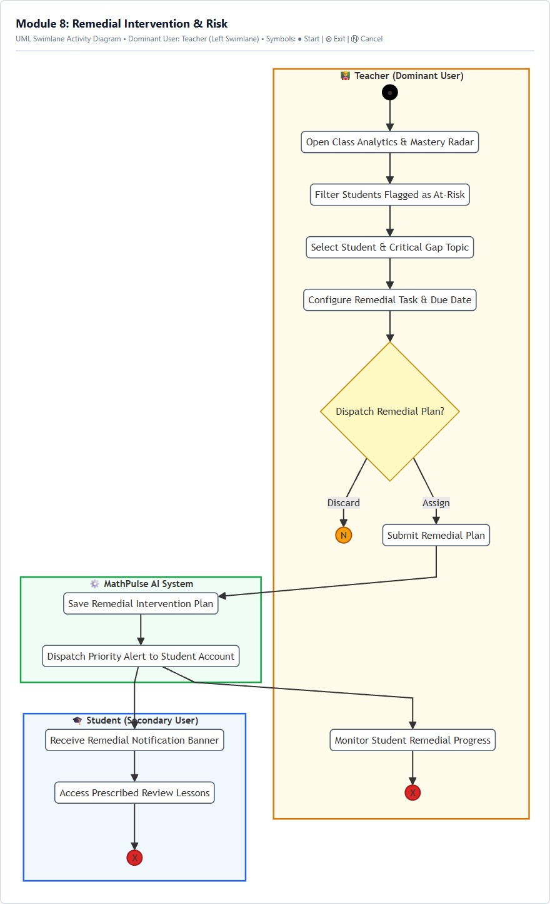
*Files: [Download Vector SVG](diagrams/activity_diagrams/mod8_remedial_intervention_risk.svg) • [Download PNG](diagrams/activity_diagrams/mod8_remedial_intervention_risk.png)*

> **Swimlane Configuration:**
> - **Left Swimlane (Dominant User):** `Teacher (Left Swimlane)`
> - **Middle/Right Swimlanes:** `MathPulse AI System` (and secondary actors where applicable)
> - **UML Symbols:** Solid Circle `((●))` = Start • Red Circle `((X))` = Exit • Orange Circle `((N))` = Cancel

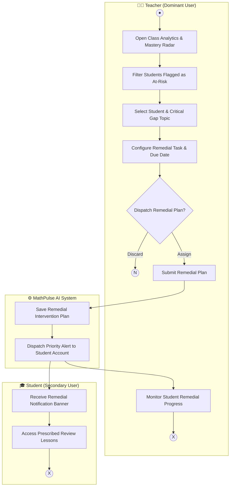
```mermaid
flowchart TD
    subgraph Teacher["👨‍🏫 Teacher (Dominant User)"]
        direction TB
        M8_Start((●)) --> M8_OpenRadar["Open Class Analytics & Mastery Radar"]
        M8_OpenRadar --> M8_FilterRisk["Filter Students Flagged as At-Risk"]
        M8_FilterRisk --> M8_SelectStudent["Select Student & Critical Gap Topic"]
        M8_SelectStudent --> M8_DraftPlan["Configure Remedial Task & Due Date"]
        M8_DraftPlan --> M8_DispatchCheck{"Dispatch Remedial Plan?"}
        M8_DispatchCheck -- "Discard" --> M8_Cancel((N))
        M8_DispatchCheck -- "Assign" --> M8_SubmitPlan["Submit Remedial Plan"]
        M8_TrackProgress["Monitor Student Remedial Progress"] --> M8_TeacherEnd((X))
    end

    subgraph System["⚙️ MathPulse AI System"]
        direction TB
        M8_SaveRecord["Save Remedial Intervention Plan"]
        M8_PushAlert["Dispatch Priority Alert to Student Account"]
    end

    subgraph Student["🎓 Student (Secondary User)"]
        direction TB
        M8_StudentAlert["Receive Remedial Notification Banner"]
        M8_OpenReview["Access Prescribed Review Lessons"]
        M8_StudentEnd((X))
    end

    M8_SubmitPlan --> M8_SaveRecord
    M8_SaveRecord --> M8_PushAlert
    M8_PushAlert --> M8_TrackProgress
    M8_PushAlert --> M8_StudentAlert
    M8_StudentAlert --> M8_OpenReview
    M8_OpenReview --> M8_StudentEnd
```

---

### Module 9: System Audit & AI Tutoring

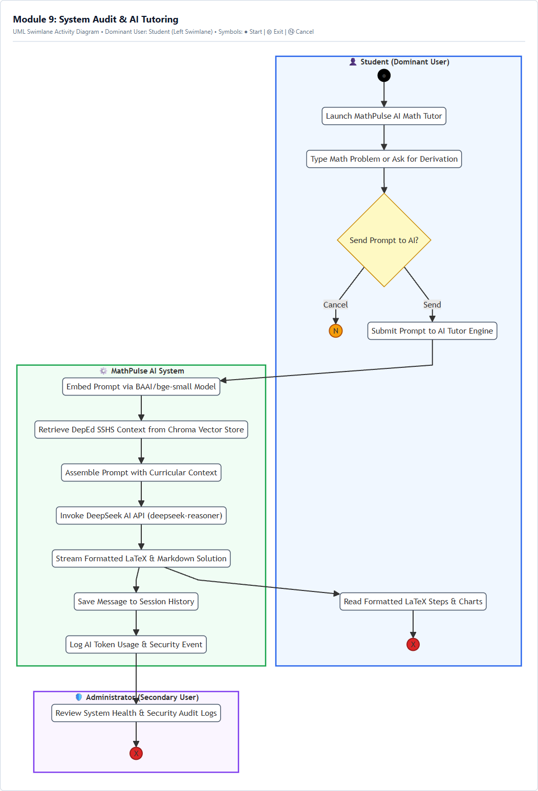
*Files: [Download Vector SVG](diagrams/activity_diagrams/mod9_system_audit_ai_tutoring.svg) • [Download PNG](diagrams/activity_diagrams/mod9_system_audit_ai_tutoring.png)*

> **Swimlane Configuration:**
> - **Left Swimlane (Dominant User):** `Student (Left Swimlane)`
> - **Middle/Right Swimlanes:** `MathPulse AI System` (and secondary actors where applicable)
> - **UML Symbols:** Solid Circle `((●))` = Start • Red Circle `((X))` = Exit • Orange Circle `((N))` = Cancel

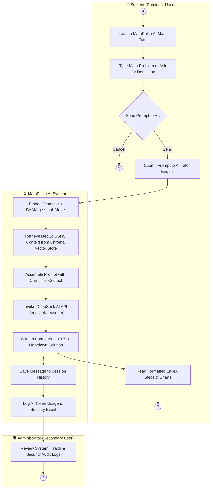
```mermaid
flowchart TD
    subgraph Student["👤 Student (Dominant User)"]
        direction TB
        M9_Start((●)) --> M9_OpenTutor["Launch MathPulse AI Math Tutor"]
        M9_OpenTutor --> M9_InputPrompt["Type Math Problem or Ask for Derivation"]
        M9_InputPrompt --> M9_PromptCheck{"Send Prompt to AI?"}
        M9_PromptCheck -- "Cancel" --> M9_Cancel((N))
        M9_PromptCheck -- "Send" --> M9_SubmitPrompt["Submit Prompt to AI Tutor Engine"]
        M9_ReadResponse["Read Formatted LaTeX Steps & Charts"] --> M9_StudentEnd((X))
    end

    subgraph System["⚙️ MathPulse AI System"]
        direction TB
        M9_Embed["Embed Prompt via BAAI/bge-small Model"]
        M9_RAGSearch["Retrieve DepEd SSHS Context from Chroma Vector Store"]
        M9_Assemble["Assemble Prompt with Curricular Context"]
        M9_CallAI["Invoke DeepSeek AI API (deepseek-reasoner)"]
        M9_Stream["Stream Formatted LaTeX & Markdown Solution"]
        M9_SaveChat["Save Message to Session History"]
        M9_LogAudit["Log AI Token Usage & Security Event"]
    end

    subgraph Admin["🛡️ Administrator (Secondary User)"]
        direction TB
        M9_AdminInspect["Review System Health & Security Audit Logs"]
        M9_AdminEnd((X))
    end

    M9_SubmitPrompt --> M9_Embed
    M9_Embed --> M9_RAGSearch
    M9_RAGSearch --> M9_Assemble
    M9_Assemble --> M9_CallAI
    M9_CallAI --> M9_Stream
    M9_Stream --> M9_ReadResponse
    M9_Stream --> M9_SaveChat
    M9_SaveChat --> M9_LogAudit
    M9_LogAudit --> M9_AdminInspect
    M9_AdminInspect --> M9_AdminEnd
```

---

## 4. Implementation & Defense Presentation Guidelines

1. **UML vs. DFD Distinction:**
   - **Activity Diagrams:** Focus exclusively on dynamic control flow, user decisions, role responsibilities (swimlanes), and transaction lifecycles. Data store symbols ($D1 dots D9$) are strictly omitted.
   - **Data Flow Diagrams (DFDs):** Detail information inputs/outputs and persistent data stores ($D1 dots D9$).
2. **Swimlane Logic:**
   - In Modules 1, 4, 5, 6, 7, 9: **Student** is on the left swimlane.
   - In Modules 2 and 8: **Teacher** is on the left swimlane.
   - In Module 3: **Teacher / Admin** is on the left swimlane.
