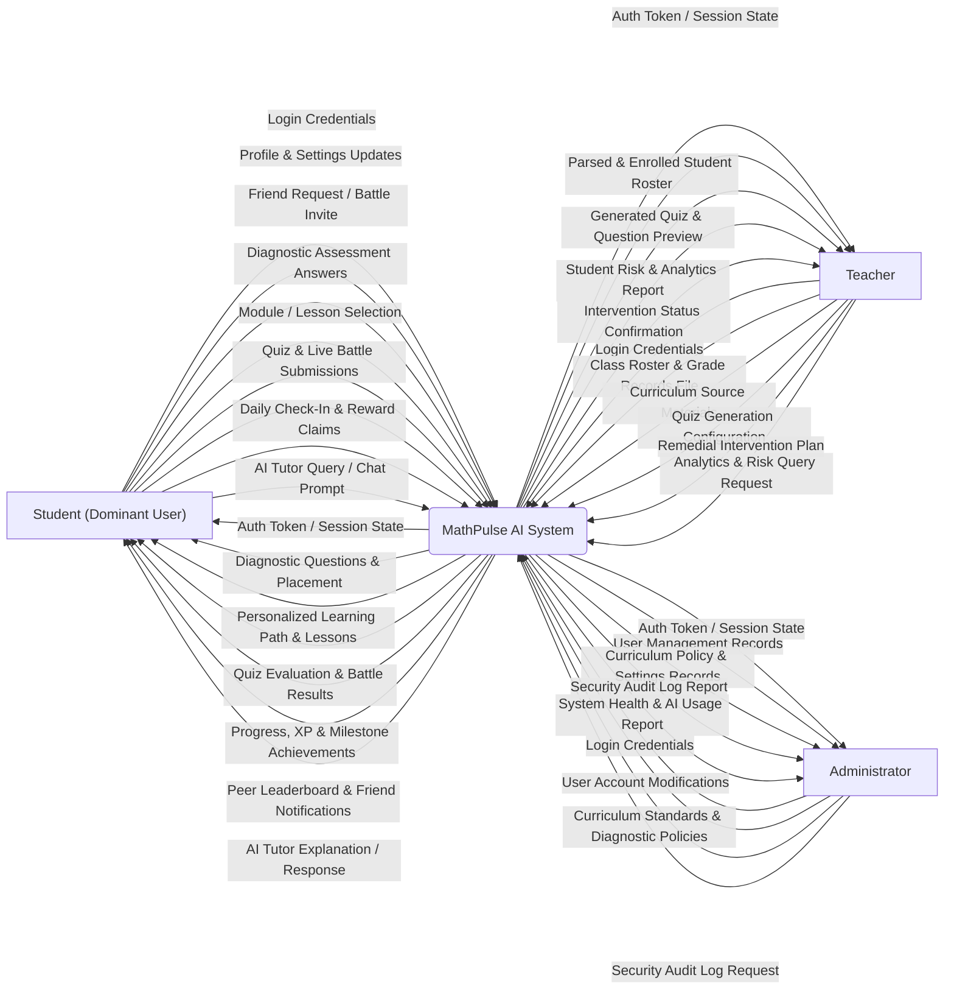

# MathPulse AI — Context Diagram (Gane & Sarson DFD Level 0)

> **Methodology:** Gane & Sarson Data Flow Diagram (DFD) Notation  
> **Target Standard:** Capstone Defense SAD & 1NF Database Architecture Alignment

---

## 1. Gane & Sarson Notation Standards Used

According to the **Gane & Sarson** DFD methodology:
1. **External Entities (Sources / Sinks):** Represented as square/rectangular boxes with distinct boundary lines (`Student`, `Teacher`, `Administrator`).
2. **Central System Process:** Represented as a rounded rectangle (`MathPulse AI System`). Per your professor's strict rule, the numeric identifier `"0"` is removed from the bubble header.
3. **Data Flows:** Directed arrows labeled with noun phrases representing data in motion.
4. **Data Stores:** None at Level 0 (introduced at Level 1 as open-ended rectangles).

---

## 2. Previous Version (Original Draft)

```text
0 MathPulse AI System

Interactions with TEACHER
IN (to System): Analytics Request
IN (to System): Quiz Configuration
IN (to System): Curriculum Source Materials (PDF/Links)
IN (to System): CSV/Excel Class Records File
IN (to System): Profile Updates
IN (to System): Login Credentials
OUT (to Teacher): Auth Token / Session State
OUT (to Teacher): Parsed & Imported Student Records
OUT (to Teacher): Generated Quiz & Preview
OUT (to Teacher): Analytics Report

Interactions with STUDENT
IN (to System): Login Credentials
IN (to System): Profile Updates
IN (to System): Diagnostic Answers
IN (to System): Module / Lesson Selection
IN (to System): AI Tutor Query / Chat Prompt
IN (to System): Quiz & Battle Submissions
IN (to System): Item Selection / XP Purchase
IN (to System): Daily Check-In Claim
OUT (to Student): Engagement, Progress & Data
OUT (to Student): Quiz Results / Feedback
OUT (to Student): AI Tutor Response
OUT (to Student): Learning Content & Assessments
OUT (to Student): Diagnostic Questions
OUT (to Student): Auth Token / Session State

Interactions with ADMINISTRATOR
IN (to System): Audit Log Request
IN (to System): Content Updates
IN (to System): User Updates
IN (to System): Login Credentials
OUT (to Administrator): Auth Token / Session State
OUT (to Administrator): User Records
OUT (to Administrator): Content Records
OUT (to Administrator): Audit Log Report
OUT (to Administrator): System Health & AI Usage Report
```

---

## 3. Revisions Needed & Gane & Sarson Adjustments

1. **Remove the "0" from Title and Central Process:**
   - *Professor's Rule:* *"Context Diagram (DFD 0): Remove the '0' from the diagram's name."*
   - In Gane & Sarson, the top partition of the process box normally holds the process number; for the Context Diagram, this number is omitted, leaving the box labeled strictly **`MathPulse AI System`**.
2. **Add Missing Module 8 Remedial Intervention Flows (Teacher):**
   - Added `Remedial Intervention Plan` (IN) and `Intervention Status Confirmation` (OUT) to reflect the `INTERVENTION_RECORD` table.
3. **Add Missing Module 1 & 7 Peer Connections / Battle Invites (Student):**
   - Added `Friend Request / Battle Invite` (IN) and `Peer Leaderboard & Friend Notifications` (OUT) to reflect `FRIENDSHIP` and `QUIZ_BATTLE_QUEUE`.
4. **Standardize Vague Data Flows to Tangible Reports:**
   - Changed *"Engagement, Progress & Data"* $\rightarrow$ **`Progress, XP & Milestone Achievements`**.
   - Changed *"CSV/Excel Class Records File"* $\rightarrow$ **`Class Roster & Grade Records File`**.

---

## 4. Gane & Sarson Master Input/Output List

### A. Interactions with STUDENT (Dominant User)
* **IN (to System):**
  1. `Login Credentials` *(Module 1)*
  2. `Profile & Settings Updates` *(Module 1)*
  3. `Friend Request / Battle Invite` *(Module 1 & 7)*
  4. `Diagnostic Assessment Answers` *(Module 4)*
  5. `Module / Lesson Selection` *(Module 3 & 6)*
  6. `Quiz & Live Battle Submissions` *(Module 5 & 7)*
  7. `Daily Check-In & Reward Claims` *(Module 6)*
  8. `AI Tutor Query / Chat Prompt` *(Module 9)*
* **OUT (to Student):**
  1. `Auth Token / Session State`
  2. `Diagnostic Questions & Placement`
  3. `Personalized Learning Path & Lessons`
  4. `Quiz Evaluation & Battle Results`
  5. `Progress, XP & Milestone Achievements`
  6. `Peer Leaderboard & Friend Notifications`
  7. `AI Tutor Explanation / Response`

---

### B. Interactions with TEACHER
* **IN (to System):**
  1. `Login Credentials` *(Module 1)*
  2. `Profile Updates` *(Module 1)*
  3. `Class Roster & Grade Records File` *(Module 2)*
  4. `Curriculum Source Materials (PDF/Links)` *(Module 3)*
  5. `Quiz Generation Configuration` *(Module 5)*
  6. `Remedial Intervention Plan` *(Module 8)*
  7. `Analytics & Risk Query Request` *(Module 2 & 8)*
* **OUT (to Teacher):**
  1. `Auth Token / Session State`
  2. `Parsed & Enrolled Student Roster`
  3. `Generated Quiz & Question Preview`
  4. `Student Risk & Analytics Report`
  5. `Intervention Status Confirmation`

---

### C. Interactions with ADMINISTRATOR
* **IN (to System):**
  1. `Login Credentials` *(Module 1)*
  2. `User Account Modifications` *(Module 1)*
  3. `Curriculum Standards & Diagnostic Policies` *(Module 3)*
  4. `Security Audit Log Request` *(Module 9)*
* **OUT (to Administrator):**
  1. `Auth Token / Session State`
  2. `User Management Records`
  3. `Curriculum Policy & Settings Records`
  4. `Security Audit Log Report`
  5. `System Health & AI Usage Report`

---

## 5. Mermaid Code (Gane & Sarson Format / Draw.io Safe)


