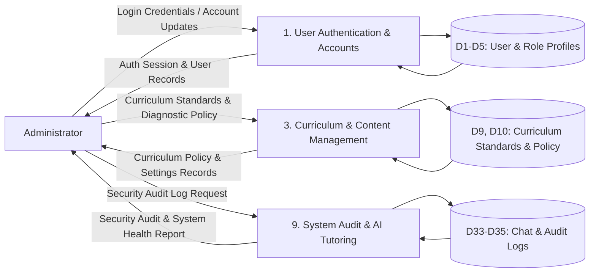

# MathPulse AI — DFD Level 1 (Administrator View)

> **Document Type:** Data Flow Diagram Level 1 — Administrator Interactions Specification  
> **Target Standard:** 1NF Relational Database & DFD Alignment for Capstone Defense

---

## 1. Previous Version (Original Draft)

```text
MATHPULSE AI - DFD LEVEL 1 (ADMIN SIDE) ORIGINAL DRAFT
1.0 Admin Authentication
IN: Login Credentials (from Admin)
IN: Admin Credentials (from D1 Users)
OUT: Auth Session (to Admin)

2.0 User Account Governance
IN: User Account Modifications (from Admin)
OUT: User Account Records (to Admin)
OUT: Updated Users (to D1 Users)

3.0 Curriculum & Policy Configuration
IN: Curriculum Standards & Policy Rules (from Admin)
OUT: Saved Policies (to D3 Curriculum)
OUT: Policy Confirmation (to Admin)

4.0 System Audit & Health Monitoring
IN: Security Audit Log Request (from Admin)
IN: Audit Data & Token Usage (from D8 System Logs)
OUT: Security Audit Log Report (to Admin)
OUT: System Health & AI Usage Report (to Admin)
```

---

## 2. Revisions Needed & Professor Rule Compliance

1. **Whole Number Process Numbering:**
   - *Professor's Rule:* *"Use whole numbers (1, 2, 3, 4, 5) instead of decimals (1.0, 2.0)."*
   - Change `1.0, 2.0...` to the standardized global module process numbers: `1`, `3`, `9`.
2. **Connect to Normalized 1NF Data Stores:**
   - Replaced generic data store names with the exact ERD stores:
     - `D1 USER`, `D4 ADMIN_PROFILE`, `D5 USER_SETTINGS`
     - `D9 CURRICULUM_VERSION_SET`, `D10 DIAGNOSTIC_POLICY`
     - `D33 CHAT_SESSION`, `D34 CHAT_MESSAGE`, `D35 AUDIT_LOG`
3. **Clarify Tangible Report Outputs:**
   - Standardized output data flows to represent formal tangible reports (*"Security Audit Log Report"*, *"System Health & AI Usage Report"*).

---

## 3. New Master List (Administrator Perspective)

### **Process 1: User Authentication & Account Management**
* **IN (from Admin):** `Login Credentials`, `User Account Modifications & Role Assignments`
* **IN (from Data Stores):** `D1 USER`, `D2 STUDENT_PROFILE`, `D3 TEACHER_PROFILE`, `D4 ADMIN_PROFILE`, `D5 USER_SETTINGS`
* **OUT (to Admin):** `Auth Session & State`, `User Management Records & Account Summaries`
* **OUT (to Data Stores):** Updates `D1`, `D2`, `D3`, `D4`, `D5`

---

### **Process 3: Curriculum & Content Management**
* **IN (from Admin):** `Curriculum Standards & Diagnostic Policy Configuration`
* **IN (from Data Stores):** `D9 CURRICULUM_VERSION_SET`, `D10 DIAGNOSTIC_POLICY`
* **OUT (to Admin):** `Curriculum Policy & Settings Records`
* **OUT (to Data Stores):** `D9 CURRICULUM_VERSION_SET`, `D10 DIAGNOSTIC_POLICY`

---

### **Process 9: System Audit & AI Tutoring**
* **IN (from Admin):** `Security Audit Log Request`
* **IN (from Data Stores):** `D33 CHAT_SESSION`, `D34 CHAT_MESSAGE`, `D35 AUDIT_LOG`
* **OUT (to Admin):** `Security Audit Log Report`, `System Health & AI Usage Report`
* **OUT (to Data Stores):** `D35 AUDIT_LOG`

---

## 4. Mermaid Code (Draw.io Compatible)


