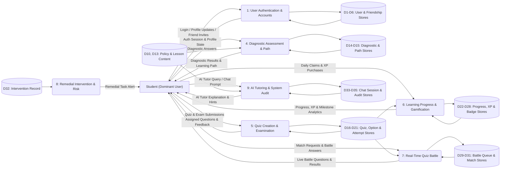

# MathPulse AI — DFD Level 1: Student View (Gane & Sarson)

> **Methodology:** Gane & Sarson Data Flow Diagram (DFD) Notation  
> **Target Standard:** 1NF Relational Database & DFD Alignment for Capstone Defense

---

## 1. Gane & Sarson Notation Standards Used

In the **Gane & Sarson** DFD convention:
1. **External Entities (Left):** Solid square/rectangular boxes representing outside user actors (`Student`).
2. **Processes (Center):** Rounded rectangles partitioned with a whole number (`1, 2, 3...`) in the top section and the process name below.
3. **Data Stores (Right):** Open-ended rectangles (open on the right) with the store identifier ($D1 \dots D35$) on the left.
4. **Data Flows:** Directed arrows carrying labeled data packets without clutter.

---

## 2. Previous Version (Original Draft)

```text
MATHPULSE AI - DFD LEVEL 1 (STUDENT SIDE) FINAL MASTER LIST
1.0 User Login
IN: Login Credentials (from Student)
IN: Existing Profile (from D1 Users)
OUT: Auth Session / Session State (to Student)
OUT: New Profile Record (to D1 Users)

2.0 Manage Profile
IN: Profile Updates (from Student)
IN: Current profile data (from D1 Users)
OUT: Profile Data (to Student)
OUT: Saved updates (to D1 Users)

3.0 Conduct Diagnostic Assessment
IN: Diagnostic Answers (from Student)
IN: Diagnostic Question Bank (from D3 Quizzes)
OUT: Diagnostic Questions (to Student)
OUT: Risk Subjects + Flag (to D1 Users)

4.0 Access Learning Modules
IN: Module selection (from Student)
IN: Student Risk Profile (from D1 Users)
IN: Student Progress Status (from D2 Modules & Lessons)
IN: Lesson content (from D2 Modules & Lessons)
OUT: Assessment & Module Content (to Student)
OUT: Topic completion (to D2 Modules & Lessons)
OUT: Module Completion (to D2 Modules & Lessons)

5.0 Quiz Battle
IN: Battle request (join / create room) (from Student)
IN: Battle answers + submission (from Student)
IN: Battle Quiz Questions (from D3 Quizzes)
IN: Battle History (from D5 Battle Records)
OUT: Battle Quiz Questions (to Student)
OUT: Matched opponent + room info (to Student)
OUT: Battle result (win / loss / draw) (to Student)
OUT: Match Result & Stats (to D5 Battle Records)

6.0 Take Quiz
IN: Quiz Answers + Submission (from Student)
IN: Quiz Questions (from D3 Quizzes)
OUT: Quiz Questions (to Student)
OUT: Quiz Results / Feedback (to Student)
OUT: Quiz Result (to D4 Quiz Results)

7.0 Track Progress & Gamification
IN: Daily Check-In Claim (from Student)
IN: Unprocessed Module Data (from D2 Modules & Lessons)
IN: Unprocessed Quiz Data (from D4 Quiz Results)
IN: Unprocessed Battle Data (from D5 Battle Records)
IN: Current XP/streak (from D6 Progress, Gamification & Leaderboard)
IN: Global Ranked XP Data (from D6 Progress, Gamification & Leaderboard)
OUT: Risk Notification (to Student)
OUT: Gamification Metrics (to Student)
OUT: Leaderboard Rankings (to Student)
OUT: Badge Notification (to Student)
OUT: Performance Analytics (to Student)
OUT: Notification Record (to D7 Notifications)
OUT: Updated XP/Streak (to D6 Progress, Gamification & Leaderboard)

8.0 AI Tutor Chat
IN: Question + History (from Student)
IN: Math Expression (from Student)
IN: Current Module Context (from D2 Modules & Lessons)
IN: Chat History (from D8 Chat History/ Messages)
OUT: Tutor Chat Data (to Student)
OUT: Chat Messages (to D8 Chat History/ Messages)

9.0 Manage Avatar & Shop
IN: Item Selection / XP Purchase (from Student)
IN: Current XP + Owned Items (from D6 Progress, Gamification & Leaderboard)
OUT: Avatar & Inventory Data (to Student)
OUT: XP Spend / Updated XP Balance (to D6 Progress, Gamification & Leaderboard)
OUT: Avatar Layers + Deducted XP (to D1 Users)
```

---

## 3. Revisions Needed & Gane & Sarson Adjustments

1. **Whole-Number Process Numbering (Gane & Sarson Rule):**
   - *Professor's Rule:* *"Use whole numbers (1, 2, 3, 4, 5) instead of decimals (1.0, 2.0)."*
   - Changed all process IDs from decimal format (`1.0, 2.0...`) to single whole numbers (`1, 4, 5, 6, 7, 8, 9`).
2. **Consolidated Fragmented Sub-Processes:**
   - Merged `User Login` (1.0) and `Manage Profile` (2.0) into **`Process 1: User Authentication & Account Management`**.
   - Merged `Take Quiz` (6.0) into **`Process 5: Quiz Creation & Examination`**.
   - Merged `Manage Avatar & Shop` (9.0) into **`Process 6: Learning Progress & Gamification`**.
3. **Aligned Open-Ended Data Stores ($D1 \dots D35$):**
   - Connected directly to the 1NF database tables defined in the ERD.
4. **Consolidated Output Arrows into Tangible Reports:**
   - Unified multiple status notifications into a clean, tangible output: **`Progress, XP & Milestone Analytics`**.

---

## 4. Gane & Sarson Master Input/Output List (Student)

### **Process 1: User Authentication & Account Management**
* **IN (from Student):** `Login Credentials`, `Profile & Preference Updates`, `Friend Request / Peer Invite`
* **IN (from Data Stores):** `D1 USER`, `D2 STUDENT_PROFILE`, `D5 USER_SETTINGS`, `D6 FRIENDSHIP`
* **OUT (to Student):** `Auth Session & Profile State`, `Friend Notification & Status`
* **OUT (to Data Stores):** `D1 USER`, `D2 STUDENT_PROFILE`, `D5 USER_SETTINGS`, `D6 FRIENDSHIP`

---

### **Process 4: Diagnostic Assessment & Learning Path**
* **IN (from Student):** `Diagnostic Assessment Answers`
* **IN (from Data Stores):** `D10 DIAGNOSTIC_POLICY`, `D13 LESSON_CONTENT`
* **OUT (to Student):** `Diagnostic Questions & Proficiency Profile`, `Personalized Learning Path Recommendations`
* **OUT (to Data Stores):** `D14 DIAGNOSTIC_RESULT`, `D15 LEARNING_PATH_RECORD`

---

### **Process 5: Quiz Creation & Examination**
* **IN (from Student):** `Quiz & Exam Submissions`
* **IN (from Data Stores):** `D16 GENERATED_QUIZ`, `D17 AI_QUIZ_QUESTION`, `D18 QUESTION_OPTION`, `D19 ASSIGNED_QUIZ`
* **OUT (to Student):** `Assigned Quiz Questions & Evaluation Feedback`
* **OUT (to Data Stores):** `D20 QUIZ_ATTEMPT`, `D21 QUIZ_ANSWER`

---

### **Process 6: Learning Progress & Gamification**
* **IN (from Student):** `Daily Check-In & Reward Claims`, `Avatar Customization & XP Purchases`
* **IN (from Data Stores):** `D13 LESSON_CONTENT`, `D20 QUIZ_ATTEMPT`, `D26 ACHIEVEMENT`
* **OUT (to Student):** `Progress, XP & Milestone Analytics`, `Leaderboard Rankings & Inventory State`
* **OUT (to Data Stores):** `D22 USER_PROGRESS`, `D23 SUBJECT_PROGRESS`, `D24 MODULE_PROGRESS`, `D25 LESSON_PROGRESS`, `D27 UNLOCKED_ACHIEVEMENT`, `D28 XP_ACTIVITY`

---

### **Process 7: Real-Time Quiz Battle**
* **IN (from Student):** `Matchmaking Request / Room Invite`, `Live Battle Answers & Submissions`
* **IN (from Data Stores):** `D17 AI_QUIZ_QUESTION`
* **OUT (to Student):** `Live Battle Questions & Match Results`, `Leaderboard Standings`
* **OUT (to Data Stores):** `D29 QUIZ_BATTLE_QUEUE`, `D30 QUIZ_BATTLE_MATCH`, `D31 QUIZ_BATTLE_PARTICIPANT`

---

### **Process 8: Remedial Intervention & Risk Monitoring**
* **IN (from Data Stores):** `D32 INTERVENTION_RECORD`
* **OUT (to Student):** `Remedial Intervention Notification & Task`

---

### **Process 9: System Audit & AI Tutoring**
* **IN (from Student):** `AI Tutor Query / Chat Prompt`
* **IN (from Data Stores):** `D13 LESSON_CONTENT`, `D33 CHAT_SESSION`, `D34 CHAT_MESSAGE`
* **OUT (to Student):** `AI Tutor Explanation & Hint Response`
* **OUT (to Data Stores):** `D33 CHAT_SESSION`, `D34 CHAT_MESSAGE`, `D35 AUDIT_LOG`

---

## 5. Mermaid Code (Gane & Sarson Format / Draw.io Safe)


