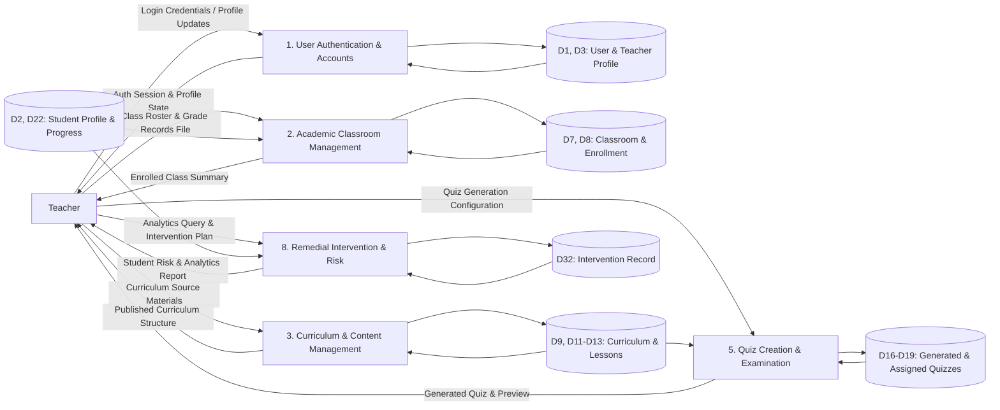

# MathPulse AI — DFD Level 1 (Teacher View)

> **Document Type:** Data Flow Diagram Level 1 — Teacher Interactions Specification  
> **Target Standard:** 1NF Relational Database & DFD Alignment for Capstone Defense

---

## 1. Previous Version (Original Draft)

```text
MATHPULSE AI - DFD LEVEL 1 (TEACHER SIDE) ORIGINAL DRAFT
1.0 Teacher Authentication
IN: Login Credentials (from Teacher)
IN: Teacher Profile Record (from D1 Users)
OUT: Session State (to Teacher)

2.0 Classroom & Student Management
IN: CSV / Excel Class Records File (from Teacher)
IN: Class Information (from D2 Classes)
OUT: Parsed & Enrolled Students (to Teacher)
OUT: Updated Class Roster (to D2 Classes)

3.0 Curriculum Management
IN: Curriculum Source Materials (PDF / Links) (from Teacher)
OUT: Published Curriculum (to Teacher)
OUT: Lesson Modules (to D3 Curriculum)

4.0 AI Quiz Maker & Examination
IN: Quiz Generation Parameters & Topics (from Teacher)
IN: Question Bank (from D4 Questions)
OUT: Generated Quiz & Preview (to Teacher)
OUT: Saved Quiz (to D4 Questions)

5.0 Student Risk Monitoring & Intervention
IN: Analytics Query (from Teacher)
IN: Student Diagnostic & Performance Data (from D5 Analytics)
OUT: Risk Analytics Report (to Teacher)
OUT: Teacher Intervention Note (to D6 Interventions)
```

---

## 2. Revisions Needed & Professor Rule Compliance

1. **Whole Number Process Numbering:**
   - *Professor's Rule:* *"Use whole numbers (1, 2, 3, 4, 5) instead of decimals (1.0, 2.0)."*
   - Change `1.0, 2.0...` to the standardized global module process numbers: `1`, `2`, `3`, `5`, `8`.
2. **Connect to Normalized 1NF Data Stores:**
   - Replaced generic data store names with the exact ERD stores:
     - `D3 TEACHER_PROFILE`
     - `D7 CLASSROOM` & `D8 CLASSROOM_STUDENT`
     - `D9 CURRICULUM_VERSION_SET`, `D11 SUBJECT`, `D12 MODULE`, `D13 LESSON_CONTENT`
     - `D16 GENERATED_QUIZ`, `D17 AI_QUIZ_QUESTION`, `D18 QUESTION_OPTION`, `D19 ASSIGNED_QUIZ`
     - `D32 INTERVENTION_RECORD`
3. **Clarify Tangible Report Outputs:**
   - Standardized output data flows to represent formal tangible reports (*"Student Risk & Analytics Report"*, *"Generated Quiz Preview"*).

---

## 3. New Master List (Teacher Perspective)

### **Process 1: User Authentication & Account Management**
* **IN (from Teacher):** `Login Credentials`, `Profile Updates`
* **IN (from Data Stores):** `D1 USER`, `D3 TEACHER_PROFILE`
* **OUT (to Teacher):** `Auth Session & Profile State`
* **OUT (to Data Stores):** Updates `D1 USER`, `D3 TEACHER_PROFILE`

---

### **Process 2: Academic Classroom Management**
* **IN (from Teacher):** `Class Roster & Grade Records File`
* **IN (from Data Stores):** `D2 STUDENT_PROFILE`, `D7 CLASSROOM`
* **OUT (to Teacher):** `Enrolled Class Summary & Roster Preview`
* **OUT (to Data Stores):** `D7 CLASSROOM`, `D8 CLASSROOM_STUDENT`

---

### **Process 3: Curriculum & Content Management**
* **IN (from Teacher):** `Curriculum Source Materials (PDF/Links)`
* **IN (from Data Stores):** `D9 CURRICULUM_VERSION_SET`, `D11 SUBJECT`, `D12 MODULE`
* **OUT (to Teacher):** `Published Curriculum Structure & Materials`
* **OUT (to Data Stores):** `D11 SUBJECT`, `D12 MODULE`, `D13 LESSON_CONTENT`

---

### **Process 5: Quiz Creation & Examination**
* **IN (from Teacher):** `Quiz Generation Configuration & Rubrics`
* **IN (from Data Stores):** `D13 LESSON_CONTENT` *(Curriculum items)*, `D16 GENERATED_QUIZ`
* **OUT (to Teacher):** `Generated Quiz & Question Preview`
* **OUT (to Data Stores):** `D16 GENERATED_QUIZ`, `D17 AI_QUIZ_QUESTION`, `D18 QUESTION_OPTION`, `D19 ASSIGNED_QUIZ`

---

### **Process 8: Remedial Intervention & Risk Monitoring**
* **IN (from Teacher):** `Analytics & Risk Query Request`, `Remedial Intervention Plan`
* **IN (from Data Stores):** `D2 STUDENT_PROFILE` *(WRI risk status)*, `D22 USER_PROGRESS`
* **OUT (to Teacher):** `Student Risk & Analytics Report`, `Intervention Status Confirmation`
* **OUT (to Data Stores):** `D32 INTERVENTION_RECORD`

---

## 4. Mermaid Code (Draw.io Compatible)


