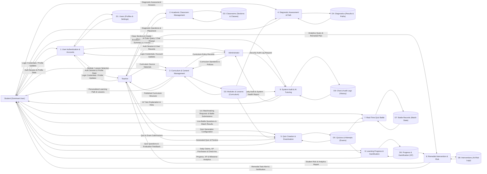

# MathPulse AI — Unified DFD Level 1 (Gane & Sarson)

> **Methodology:** Gane & Sarson Data Flow Diagram (DFD) Notation  
> **Target Standard:** Capstone Defense SAD & Active Codebase Alignment  
> **Scope:** Unified System Architecture (Student, Teacher, Administrator)

---

## 1. Gane & Sarson Notation & Layout Standards

According to the **Gane & Sarson** DFD conventions and capstone defense guidelines:
1. **Left Column (External Entities / Users):**
   * Top-Left: **`Student (Dominant User)`**
   * Middle-Left: **`Teacher`**
   * Bottom-Left: **`Administrator`**
2. **Center Column (Processes 1 to 9):**
   * Formatted as **uniform rounded rectangles** with whole-number header partitions (**`1, 2, 3, 4, 5, 6, 7, 8, 9`**).
   * Arranged sequentially following the user lifecycle after login.
3. **Right Column (Open-Ended Data Stores D1 to D9):**
   * Formatted as **open-ended rectangles** (top, bottom, and left borders, with the right side open).
4. **Data Flows:**
   * Directed arrows carrying clear, tangible noun-phrase data packets.

---

## 2. Process-by-Process Flow Specification (1 to 9)

---

### Process 1: `User Authentication & Accounts`

```
┌────────────────────────────────────────────────────────────────────────┐
│ 1                                                                      │
│ User Authentication & Accounts                                         │
└────────────────────────────────────────────────────────────────────────┘
```

* **Incoming Flows ($\longrightarrow$ into Process 1):**
  * `Login Credentials / Profile Updates` *(from Student)*
  * `Login Credentials / Profile Updates` *(from Teacher)*
  * `Login Credentials / Account Updates` *(from Administrator)*
  * `Existing Profile Record` *(from D1: Users)*
* **Outgoing Flows ($\longleftarrow$ out of Process 1):**
  * `Auth Session & Profile State` *(to Student)*
  * `Auth Session & Profile State` *(to Teacher)*
  * `Auth Session & User Records` *(to Administrator)*
  * `Updated Account / Profile Data` *(to D1: Users)*
* **Connected Data Store:** **`D1: Users`** *(Profiles & Settings)*

---

### Process 2: `Academic Classroom Management`

```
┌────────────────────────────────────────────────────────────────────────┐
│ 2                                                                      │
│ Academic Classroom Management                                          │
└────────────────────────────────────────────────────────────────────────┘
```

* **Incoming Flows ($\longrightarrow$ into Process 2):**
  * `Class Sections & Grade Records File` *(from Teacher)*
  * `Existing Section Data` *(from D2: Classrooms)*
* **Outgoing Flows ($\longleftarrow$ out of Process 2):**
  * `Enrolled Class Sections Summary & Preview` *(to Teacher)*
  * `Saved Class & Student Section Records` *(to D2: Classrooms)*
* **Connected Data Store:** **`D2: Classrooms`** *(Sections & Classes)*

---

### Process 3: `Curriculum & Content Management`

```
┌────────────────────────────────────────────────────────────────────────┐
│ 3                                                                      │
│ Curriculum & Content Management                                        │
└────────────────────────────────────────────────────────────────────────┘
```

* **Incoming Flows ($\longrightarrow$ into Process 3):**
  * `Curriculum Source Materials (PDFs/Links)` *(from Teacher)*
  * `Curriculum Standards & Diagnostic Policies` *(from Administrator)*
  * `Module / Lesson Selection` *(from Student)*
  * `Stored Curriculum & Lesson Data` *(from D3: Modules & Lessons)*
* **Outgoing Flows ($\longleftarrow$ out of Process 3):**
  * `Personalized Learning Path & Lessons` *(to Student)*
  * `Published Curriculum Structure` *(to Teacher)*
  * `Curriculum Policy Records` *(to Administrator)*
  * `Published Lesson Modules & Policies` *(to D3: Modules & Lessons)*
* **Connected Data Store:** **`D3: Modules & Lessons`** *(Curriculum)*

---

### Process 4: `Diagnostic Assessment & Path`

```
┌────────────────────────────────────────────────────────────────────────┐
│ 4                                                                      │
│ Diagnostic Assessment & Path                                           │
└────────────────────────────────────────────────────────────────────────┘
```

* **Incoming Flows ($\longrightarrow$ into Process 4):**
  * `Diagnostic Assessment Answers` *(from Student)*
  * `Diagnostic Question Bank & Policies` *(from D3: Modules & Lessons)*
  * `Previous Diagnostic History` *(from D4: Diagnostics)*
* **Outgoing Flows ($\longleftarrow$ out of Process 4):**
  * `Diagnostic Questions & Placement` *(to Student)*
  * `Diagnostic Scores & Learning Path Records` *(to D4: Diagnostics)*
* **Connected Data Store:** **`D4: Diagnostics`** *(Results & Paths)*

---

### Process 5: `Quiz Creation & Examination`

```
┌────────────────────────────────────────────────────────────────────────┐
│ 5                                                                      │
│ Quiz Creation & Examination                                            │
└────────────────────────────────────────────────────────────────────────┘
```

* **Incoming Flows ($\longrightarrow$ into Process 5):**
  * `Quiz Generation Configuration` *(from Teacher)*
  * `Quiz & Exam Submissions` *(from Student)*
  * `Lesson Material & Question Bank` *(from D3: Modules & Lessons)*
  * `Stored Quizzes & Prior Attempts` *(from D5: Quizzes & Attempts)*
* **Outgoing Flows ($\longleftarrow$ out of Process 5):**
  * `Generated Quiz & Preview` *(to Teacher)*
  * `Quiz Questions & Evaluation Feedback` *(to Student)*
  * `Saved Quizzes, Attempts & Answers` *(to D5: Quizzes & Attempts)*
* **Connected Data Store:** **`D5: Quizzes & Attempts`** *(Exams)*

---

### Process 6: `Learning Progress & Gamification`

```
┌────────────────────────────────────────────────────────────────────────┐
│ 6                                                                      │
│ Learning Progress & Gamification                                       │
└────────────────────────────────────────────────────────────────────────┘
```

* **Incoming Flows ($\longrightarrow$ into Process 6):**
  * `Daily Claims, XP Purchases & Check-Ins` *(from Student)*
  * `Completed Exam & Quiz Scores` *(from D5: Quizzes & Attempts)*
  * `Current XP, Streak & Badge Data` *(from D6: Progress & Gamification)*
* **Outgoing Flows ($\longleftarrow$ out of Process 6):**
  * `Progress, XP & Milestone Analytics` *(to Student)*
  * `Leaderboard Rankings & Inventory State` *(to Student)*
  * `Updated XP, Progress & Unlocked Badges` *(to D6: Progress & Gamification)*
* **Connected Data Store:** **`D6: Progress & Gamification`** *(XP & Badges)*

---

### Process 7: `Real-Time Quiz Battle`

```
┌────────────────────────────────────────────────────────────────────────┐
│ 7                                                                      │
│ Real-Time Quiz Battle                                                  │
└────────────────────────────────────────────────────────────────────────┘
```

* **Incoming Flows ($\longrightarrow$ into Process 7):**
  * `1v1 Matchmaking Requests & Battle Submissions` *(from Student)*
  * `Battle Question Pool` *(from D5: Quizzes & Attempts)*
  * `Battle History & Active Match State` *(from D7: Battle Records)*
* **Outgoing Flows ($\longleftarrow$ out of Process 7):**
  * `Live Battle Questions & Match Results` *(to Student)*
  * `Match Session Record & Final Scores` *(to D7: Battle Records)*
* **Connected Data Store:** **`D7: Battle Records`** *(Match State)*

---

### Process 8: `Remedial Intervention & Risk`

```
┌────────────────────────────────────────────────────────────────────────┐
│ 8                                                                      │
│ Remedial Intervention & Risk                                           │
└────────────────────────────────────────────────────────────────────────┘
```

* **Incoming Flows ($\longrightarrow$ into Process 8):**
  * `Analytics Query & Remedial Plan` *(from Teacher)*
  * `Student Mastery & Risk Performance` *(from D6: Progress & Gamification)*
  * `Intervention History` *(from D8: Interventions)*
* **Outgoing Flows ($\longleftarrow$ out of Process 8):**
  * `Student Risk & Analytics Report` *(to Teacher)*
  * `Remedial Task Alert & Notification` *(to Student)*
  * `Intervention Order & Log Records` *(to D8: Interventions)*
* **Connected Data Store:** **`D8: Interventions`** *(At-Risk Logs)*

---

### Process 9: `System Audit & AI Tutoring`

```
┌────────────────────────────────────────────────────────────────────────┐
│ 9                                                                      │
│ System Audit & AI Tutoring                                             │
└────────────────────────────────────────────────────────────────────────┘
```

* **Incoming Flows ($\longrightarrow$ into Process 9):**
  * `AI Tutor Query / Chat Prompt` *(from Student)*
  * `Security Audit Log Request` *(from Administrator)*
  * `Curriculum Context for RAG` *(from D3: Modules & Lessons)*
  * `Chat History & Audit Logs` *(from D9: Chat & Audit Logs)*
* **Outgoing Flows ($\longleftarrow$ out of Process 9):**
  * `AI Tutor Explanation & Hints` *(to Student)*
  * `Security Audit & System Health Report` *(to Administrator)*
  * `Saved Chat Sessions & Security Logs` *(to D9: Chat & Audit Logs)*
* **Connected Data Store:** **`D9: Chat & Audit Logs`** *(History & Audits)*

---

## 3. Data Store Mapping Reference ($D1 \dots D9$)

| Store ID | Data Store Name | Real Codebase / ERD Entities Represented |
|---|---|---|
| **`D1`** | **`Users`** | `USER`, `STUDENT_PROFILE`, `TEACHER_PROFILE`, `ADMIN_PROFILE`, `USER_SETTINGS` |
| **`D2`** | **`Classrooms`** | `CLASSROOM` *(Sections & Classes)* |
| **`D3`** | **`Modules & Lessons`** | `CURRICULUM_VERSION_SET`, `DIAGNOSTIC_POLICY`, `SUBJECT`, `MODULE`, `LESSON_CONTENT` |
| **`D4`** | **`Diagnostics`** | `DIAGNOSTIC_RESULT`, `LEARNING_PATH_RECORD` |
| **`D5`** | **`Quizzes & Attempts`** | `GENERATED_QUIZ`, `AI_QUIZ_QUESTION`, `ASSIGNED_QUIZ`, `QUIZ_ATTEMPT`, `QUIZ_ANSWER` |
| **`D6`** | **`Progress & Gamification`** | `USER_PROGRESS`, `SUBJECT_PROGRESS`, `MODULE_PROGRESS`, `LESSON_PROGRESS`, `ACHIEVEMENTS`, `XP_ACTIVITY` |
| **`D7`** | **`Battle Records`** | Firebase Realtime Database battle matchmaking & match state |
| **`D8`** | **`Interventions`** | `INTERVENTION_RECORD` |
| **`D9`** | **`Chat & Audit Logs`** | `CHAT_SESSION`, `CHAT_MESSAGE`, `AUDIT_LOG` |

---

## 4. Mermaid.js Code (Draw.io Compatible)


