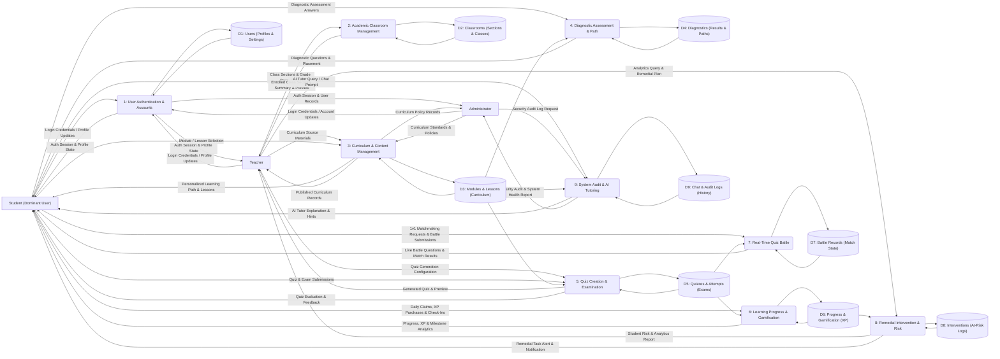

# MathPulse AI — System Architecture & Gane & Sarson DFD Specification

> **Methodology:** Gane & Sarson Data Flow Diagram (DFD) Notation & 28-Entity ERD  
> **Target Standard:** Capstone Defense SAD & Active Codebase Alignment

---

## 1. Gane & Sarson Notation Standards Used

In the **Gane & Sarson** methodology:
1. **External Entities (Left):** Solid square/rectangular boxes representing the actors (**Student**, **Teacher**, **Administrator**). The dominant user (**Student**) is grouped prominently on the top-left.
2. **Processes (Center):** Rounded rectangles with whole-number header partitions (**`1, 2, 3, 4, 5, 6, 7, 8, 9`**), arranged sequentially based on the student/teacher educational lifecycle after login.
3. **Data Stores (Right):** Open-ended horizontal rectangles (**`D1` through `D9`**) representing the system's database storage collections.
4. **Data Flows:** Directed arrows labeled with concrete, tangible noun-phrase data packets.

---

## 2. The 28 Core System Entities (ERD Master List)

| # | Entity Name | Key Indicators (Col 1) | Attributes (Col 2) | Real Code Reference |
|:---:|---|---|---|---|
| **1** | **`USER`** | `PK uid` | `email`, `name`, `role`, `photo`, `createdAt` | `interface User` |
| **2** | **`STUDENT_PROFILE`** | `PK, FK uid` | `lrn`, `grade`, `school`, `level`, `currentXP`, `streak`, `overallRisk`, `hasTakenDiagnostic` | `interface StudentProfile` |
| **3** | **`TEACHER_PROFILE`** | `PK, FK uid` | `department`, `subject`, `yearsOfExperience`, `qualification` | `interface TeacherProfile` |
| **4** | **`ADMIN_PROFILE`** | `PK, FK uid` | `position`, `department` | `interface AdminProfile` |
| **5** | **`USER_SETTINGS`** | `PK, FK uid` | `notifications`, `appearance`, `privacy`, `learning`, `adminPanel` | `interface UserSettings` |
| **6** | **`CLASSROOM`** | `PK classId` `FK teacherId` | `className`, `gradeLevel`, `section`, `strand`, `subject` | `AdminClassManagement` |
| **7** | **`CURRICULUM_VERSION_SET`** | `PK id` | `label`, `program`, `gradeLevel`, `isActive` | `CurriculumVersionSet` |
| **8** | **`DIAGNOSTIC_POLICY`** | `PK id` `FK versionSetId` | `gradeLevel`, `thresholds` | `DiagnosticPolicy` |
| **9** | **`SUBJECT`** | `PK id` `FK versionSetId` | `name`, `gradeLevel` | `curriculumData.ts` |
| **10** | **`MODULE`** | `PK id` `FK subjectId` | `name`, `targetTopic` | `curriculumData.ts` |
| **11** | **`LESSON_CONTENT`** | `PK id` `FK moduleId` `FK authorId` | `title`, `targetSkill`, `contentUrl`, `isPublished` | `LessonViewer.tsx` |
| **12** | **`GENERATED_QUIZ`** | `PK id` `FK teacherId` | `title`, `gradeLevel`, `totalPoints`, `status`, `source` | `GeneratedQuiz` |
| **13** | **`AI_QUIZ_QUESTION`** | `PK id` `FK quizId` | `questionType`, `questionText`, `options`, `correctAnswer`, `bloomLevel`, `difficulty` | `AIQuizQuestion` |
| **14** | **`ASSIGNED_QUIZ`** | `PK id` `FK quizId` `FK lrn` | `subject`, `status`, `assignedAt`, `dueDate` | `AssignedQuiz` |
| **15** | **`DIAGNOSTIC_RESULT`** | `PK docId` `FK uid` | `rawScore`, `percentage`, `proficiencyLevel`, `competencyScores`, `completedAt` | `AssessmentResult` |
| **16** | **`LEARNING_PATH_RECORD`** | `PK id` `FK userId` `FK lessonId` | `source`, `reason`, `generatedAt` | `LearningPathRecord` |
| **17** | **`INTERVENTION_RECORD`** | `PK id` `FK lrn` `FK teacherId` | `content`, `source`, `createdAt` | `InterventionRecord` |
| **18** | **`USER_PROGRESS`** | `PK, FK userId` | `totalLessonsCompleted`, `totalQuizzesCompleted`, `averageScore`, `updatedAt` | `UserProgress` |
| **19** | **`SUBJECT_PROGRESS`** | `PK id` `FK userId` `FK subjectId` | `progress`, `completedModules` | `SubjectProgress` |
| **20** | **`MODULE_PROGRESS`** | `PK id` `FK subjectProgressId` `FK moduleId` | `progress`, `lessonsCompleted` | `ModuleProgress` |
| **21** | **`LESSON_PROGRESS`** | `PK id` `FK userId` `FK lessonId` | `completed`, `timeSpent`, `score` | `LessonProgress` |
| **22** | **`QUIZ_ATTEMPT`** | `PK attemptId` `FK userId` `FK quizId` | `attemptNumber`, `score`, `completedAt` | `QuizAttempt` |
| **23** | **`QUIZ_ANSWER`** | `PK answerId` `FK attemptId` `FK questionId` | `selectedAnswer`, `isCorrect` | `QuizAnswer` |
| **24** | **`ACHIEVEMENTS`** | `PK, FK userId` | `achievements`, `totalAchievements`, `updatedAt` | `UserAchievements` |
| **25** | **`XP_ACTIVITY`** | `PK activityId` `FK userId` | `type`, `xpEarned`, `description`, `timestamp` | `XPActivity` |
| **26** | **`CHAT_SESSION`** | `PK id` `FK userId` | `title`, `isActive`, `createdAt` | `ChatSession` |
| **27** | **`CHAT_MESSAGE`** | `PK id` `FK sessionId` | `role`, `content`, `timestamp` | `ChatMessage` |
| **28** | **`AUDIT_LOG`** | `PK id` `FK userId` | `action`, `targetType`, `timestamp` | `AuditLog` |

---

## 3. Gane & Sarson DFD Level 1 (Unified System Architecture)

---

## 4. Gane & Sarson Process & Data Store Master Checklist

| DFD 1 Process | Process Description | Connected Data Store ID & Name | Mapped ERD Entities |
|---|---|---|---|
| **1** | User Authentication & Accounts | **`D1: Users`** | `USER`, `STUDENT_PROFILE`, `TEACHER_PROFILE`, `ADMIN_PROFILE`, `USER_SETTINGS` |
| **2** | Academic Classroom Management | **`D2: Classrooms`** | `CLASSROOM` |
| **3** | Curriculum & Content Management | **`D3: Modules & Lessons`** | `CURRICULUM_VERSION_SET`, `DIAGNOSTIC_POLICY`, `SUBJECT`, `MODULE`, `LESSON_CONTENT` |
| **4** | Diagnostic Assessment & Path | **`D4: Diagnostics`** | `DIAGNOSTIC_RESULT`, `LEARNING_PATH_RECORD` |
| **5** | Quiz Creation & Examination | **`D5: Quizzes & Attempts`** | `GENERATED_QUIZ`, `AI_QUIZ_QUESTION`, `ASSIGNED_QUIZ`, `QUIZ_ATTEMPT`, `QUIZ_ANSWER` |
| **6** | Learning Progress & Gamification | **`D6: Progress & Gamification`** | `USER_PROGRESS`, `SUBJECT_PROGRESS`, `MODULE_PROGRESS`, `LESSON_PROGRESS`, `ACHIEVEMENTS`, `XP_ACTIVITY` |
| **7** | Real-Time Quiz Battle | **`D7: Battle Records`** | Realtime Database battle state & match history |
| **8** | Remedial Intervention & Risk | **`D8: Interventions`** | `INTERVENTION_RECORD` |
| **9** | System Audit & AI Tutoring | **`D9: Chat & Audit Logs`** | `CHAT_SESSION`, `CHAT_MESSAGE`, `AUDIT_LOG` |
