# MathPulse AI — System Architecture, 1NF ERD & DFD Mapping

> **Document Purpose:** Master system architecture, First Normal Form (1NF) Entity-Relationship Diagram, and complete 1:1 Data Flow Diagram (DFD) Data Store Mapping for MathPulse AI Capstone Defense.

---

## 1. Executive Summary & Defense Compliance

This specification strictly implements all normalization and diagramming standards:
1. **Strict 1NF Compliance:** All multi-valued arrays, nested maps, and composite objects from the legacy diagram are fully decomposed into relational tables with scalar atomic attributes.
2. **Exact 1:1 DFD Store Alignment:** Every single entity in the ERD corresponds directly to an open-ended data store in DFD Level 0 (Context), Level 1, and Level 2+ diagrams ($D1 \dots D35$).
3. **DFD Level 1 & Level 2 Process Consistency:** Main processes are numbered using whole numbers (`1, 2, 3...`), with Process 1 designated as **User Authentication**, and Level 2 decomposed with decimal numbering (`1.1, 1.2...`).
4. **Use Case Noun/Pronoun Standardization:** All central use case titles use noun/pronoun phrases rather than action verbs.

---

## 2. 1NF Normalization Changelog

| Legacy Entity Flaw | 1NF Normalization Solution | Primary Key (PK) & Foreign Keys (FK) |
|---|---|---|
| `CLASSROOM.managedStudents` array | Decomposed into associative table `CLASSROOM_STUDENT` | `id PK`, `classId FK`, `studentId FK` |
| `AI_QUIZ_QUESTION.options` array | Extracted into `QUESTION_OPTION` | `id PK`, `questionId FK`, `optionIndex`, `optionText` |
| `DIAGNOSTIC_POLICY.thresholds` object | Flattened into scalar columns | `masteredThreshold`, `needsReviewThreshold`, `criticalGapThreshold` |
| `FRIENDSHIP.uids` array | Normalized into dual foreign keys | `friendshipId PK`, `userId1 FK`, `userId2 FK` |
| `QUIZ_BATTLE_MATCH` scores map | Decomposed into `QUIZ_BATTLE_PARTICIPANT` | `id PK`, `matchId FK`, `userId FK`, `score`, `isWinner` |
| `ACHIEVEMENTS` counter bag | Normalized into definition & unlock bridging tables | `ACHIEVEMENT` (Master), `UNLOCKED_ACHIEVEMENT` (Bridge) |
| `DIAGNOSTIC_RESULT.proficiencyProfile` | Broken down into scalar fields | `rawScore`, `proficiencyLevel`, `timeSpentSeconds` |

---

## 3. Master Entity-Relationship Diagram (ERD)

```mermaid
erDiagram
    %% ============================================================
    %% MODULE 1: USER AUTHENTICATION & MANAGEMENT
    %% ============================================================
    USER ||--o| STUDENT_PROFILE : "specializes into"
    USER ||--o| TEACHER_PROFILE : "specializes into"
    USER ||--o| ADMIN_PROFILE : "specializes into"
    USER ||--|| USER_SETTINGS : "configures"
    USER ||--o{ FRIENDSHIP : "userId1"
    USER ||--o{ FRIENDSHIP : "userId2"

    %% ============================================================
    %% MODULE 2: ACADEMIC CLASSROOM MANAGEMENT
    %% ============================================================
    TEACHER_PROFILE ||--o{ CLASSROOM : "owns / manages"
    CLASSROOM ||--o{ CLASSROOM_STUDENT : "enrolls"
    STUDENT_PROFILE ||--o{ CLASSROOM_STUDENT : "belongs to"

    %% ============================================================
    %% MODULE 3: CURRICULUM & CONTENT MANAGEMENT
    %% ============================================================
    CURRICULUM_VERSION_SET ||--o{ DIAGNOSTIC_POLICY : "enforces"
    CURRICULUM_VERSION_SET ||--o{ SUBJECT : "defines structure"
    SUBJECT ||--o{ MODULE : "contains"
    MODULE ||--o{ LESSON_CONTENT : "houses"
    TEACHER_PROFILE ||--o{ LESSON_CONTENT : "authors"

    %% ============================================================
    %% MODULE 4: DIAGNOSTIC ASSESSMENT & LEARNING PATH
    %% ============================================================
    STUDENT_PROFILE ||--o{ DIAGNOSTIC_RESULT : "generates"
    STUDENT_PROFILE ||--o{ LEARNING_PATH_RECORD : "follows"
    LESSON_CONTENT ||--o{ LEARNING_PATH_RECORD : "recommends"

    %% ============================================================
    %% MODULE 5: QUIZ CREATION & EVALUATION
    %% ============================================================
    TEACHER_PROFILE ||--o{ GENERATED_QUIZ : "creates"
    GENERATED_QUIZ ||--o{ AI_QUIZ_QUESTION : "contains"
    AI_QUIZ_QUESTION ||--o{ QUESTION_OPTION : "has options"
    GENERATED_QUIZ ||--o{ ASSIGNED_QUIZ : "assigned via"
    STUDENT_PROFILE ||--o{ ASSIGNED_QUIZ : "takes"
    GENERATED_QUIZ ||--o{ QUIZ_ATTEMPT : "attempted on"
    QUIZ_ATTEMPT ||--o{ QUIZ_ANSWER : "includes"
    AI_QUIZ_QUESTION ||--o{ QUIZ_ANSWER : "answers"

    %% ============================================================
    %% MODULE 6: LEARNING PROGRESS & GAMIFICATION
    %% ============================================================
    STUDENT_PROFILE ||--|| USER_PROGRESS : "tracks"
    USER_PROGRESS ||--o{ SUBJECT_PROGRESS : "records"
    SUBJECT_PROGRESS ||--o{ MODULE_PROGRESS : "records"
    MODULE_PROGRESS ||--o{ LESSON_PROGRESS : "records"
    LESSON_CONTENT ||--o{ LESSON_PROGRESS : "completed in"
    USER_PROGRESS ||--o{ QUIZ_ATTEMPT : "records"
    STUDENT_PROFILE ||--o{ XP_ACTIVITY : "earns"
    STUDENT_PROFILE ||--o{ UNLOCKED_ACHIEVEMENT : "unlocks"
    ACHIEVEMENT ||--o{ UNLOCKED_ACHIEVEMENT : "awarded as"

    %% ============================================================
    %% MODULE 7: QUIZ BATTLE SYSTEM
    %% ============================================================
    STUDENT_PROFILE ||--o{ QUIZ_BATTLE_QUEUE : "joins"
    QUIZ_BATTLE_MATCH ||--o{ QUIZ_BATTLE_PARTICIPANT : "engages"
    STUDENT_PROFILE ||--o{ QUIZ_BATTLE_PARTICIPANT : "plays as"

    %% ============================================================
    %% MODULE 8: REMEDIAL INTERVENTION & RISK MONITORING
    %% ============================================================
    TEACHER_PROFILE ||--o{ INTERVENTION_RECORD : "triggers"
    STUDENT_PROFILE ||--o{ INTERVENTION_RECORD : "assigned"

    %% ============================================================
    %% MODULE 9: SYSTEM AUDIT & AI COMMUNICATION
    %% ============================================================
    USER ||--o{ CHAT_SESSION : "starts"
    CHAT_SESSION ||--o{ CHAT_MESSAGE : "contains"
    USER ||--o{ AUDIT_LOG : "triggers log event"

    %% ============================================================
    %% ENTITY DEFINITIONS & ATOMIC ATTRIBUTES
    %% ============================================================

    USER {
        string uid PK
        string email
        string name
        string role
        timestamp createdAt
    }

    STUDENT_PROFILE {
        string uid PK, FK
        string lrn
        string grade
        string school
        int level
        int currentXP
        int streak
        string overallRisk
        boolean hasTakenDiagnostic
    }

    TEACHER_PROFILE {
        string uid PK, FK
        string department
        string subject
        string yearsOfExperience
    }

    ADMIN_PROFILE {
        string uid PK, FK
        string position
        string department
    }

    USER_SETTINGS {
        string uid PK, FK
        boolean emailNotifications
        boolean darkMode
        string profileVisibility
        int dailyXpGoal
    }

    FRIENDSHIP {
        string friendshipId PK
        string userId1 FK
        string userId2 FK
        string status
        timestamp createdAt
    }

    CLASSROOM {
        string classId PK
        string teacherId FK
        string className
        string gradeLevel
        string subject
    }

    CLASSROOM_STUDENT {
        string id PK
        string classId FK
        string studentId FK
        timestamp enrolledAt
    }

    CURRICULUM_VERSION_SET {
        string id PK
        string label
        string program
        string gradeLevel
    }

    DIAGNOSTIC_POLICY {
        string id PK
        string versionSetId FK
        string gradeLevel
        float masteredThreshold
        float needsReviewThreshold
        float criticalGapThreshold
    }

    SUBJECT {
        string id PK
        string versionSetId FK
        string name
        string gradeLevel
    }

    MODULE {
        string id PK
        string subjectId FK
        string name
        string targetTopic
    }

    LESSON_CONTENT {
        string id PK
        string moduleId FK
        string authorId FK
        string title
        string targetSkill
        string contentUrl
        boolean isPublished
    }

    DIAGNOSTIC_RESULT {
        string docId PK
        string uid FK
        float rawScore
        string proficiencyLevel
        int timeSpentSeconds
        timestamp completedAt
    }

    LEARNING_PATH_RECORD {
        string id PK
        string userId FK
        string lessonId FK
        string source
        string reason
        timestamp generatedAt
    }

    GENERATED_QUIZ {
        string id PK
        string teacherId FK
        string title
        string status
        timestamp createdAt
    }

    AI_QUIZ_QUESTION {
        string id PK
        string quizId FK
        string questionType
        string questionText
        string difficulty
        string correctAnswer
    }

    QUESTION_OPTION {
        string id PK
        string questionId FK
        int optionIndex
        string optionText
    }

    ASSIGNED_QUIZ {
        string id PK
        string quizId FK
        string studentId FK
        string subject
        string status
        timestamp assignedAt
        timestamp dueDate
    }

    QUIZ_ATTEMPT {
        string attemptId PK
        string userId FK
        string quizId FK
        int attemptNumber
        float score
        timestamp completedAt
    }

    QUIZ_ANSWER {
        string answerId PK
        string attemptId FK
        string questionId FK
        string selectedAnswer
        boolean isCorrect
    }

    USER_PROGRESS {
        string userId PK, FK
        int totalLessonsCompleted
        int totalQuizzesCompleted
        float averageScore
        timestamp updatedAt
    }

    SUBJECT_PROGRESS {
        string id PK
        string userId FK
        string subjectId FK
        float progress
    }

    MODULE_PROGRESS {
        string id PK
        string subjectProgressId FK
        string moduleId FK
        float progress
    }

    LESSON_PROGRESS {
        string id PK
        string moduleProgressId FK
        string lessonId FK
        boolean completed
        int timeSpent
        float score
        timestamp completedAt
    }

    ACHIEVEMENT {
        string id PK
        string title
        string description
        int xpReward
    }

    UNLOCKED_ACHIEVEMENT {
        string id PK
        string userId FK
        string achievementId FK
        timestamp unlockedAt
    }

    XP_ACTIVITY {
        string activityId PK
        string userId FK
        string type
        int xpEarned
        timestamp timestamp
    }

    QUIZ_BATTLE_MATCH {
        string matchId PK
        string mode
        string status
        string subject
        timestamp createdAt
    }

    QUIZ_BATTLE_PARTICIPANT {
        string id PK
        string matchId FK
        string userId FK
        int score
        boolean isWinner
    }

    QUIZ_BATTLE_QUEUE {
        string queueId PK
        string userId FK
        string subject
        string difficulty
        timestamp joinedAt
    }

    INTERVENTION_RECORD {
        string id PK
        string userId FK
        string teacherId FK
        string content
        string source
        timestamp createdAt
    }

    CHAT_SESSION {
        string id PK
        string userId FK
        string title
        boolean isActive
        timestamp createdAt
    }

    CHAT_MESSAGE {
        string id PK
        string sessionId FK
        string role
        string content
        timestamp timestamp
    }

    AUDIT_LOG {
        string id PK
        string userId FK
        string action
        string targetType
        timestamp timestamp
    }
```

---

## 4. Master DFD Alignment Matrix

Use this table to construct and cross-reference your **Context Diagram**, **DFD Level 1**, **DFD Level 2+**, and **Use Case Diagrams**.

| DFD 1 Process # | Module Name | Main Use Case Title (Noun/Pronoun) | DFD 2 Sub-Processes (Decimals) | Open-Ended DFD Data Stores |
|:---:|---|---|---|---|
| **1** | **User Authentication** | User Account & Authentication | `1.1` User Login & Session Validation `1.2` User Profile Management `1.3` Preference Configuration `1.4` Peer Friendship Connection | `D1: USER` `D2: STUDENT_PROFILE` `D3: TEACHER_PROFILE` `D4: ADMIN_PROFILE` `D5: USER_SETTINGS` `D6: FRIENDSHIP` |
| **2** | **Academic Classroom Management** | Classroom Management | `2.1` Class Section Creation `2.2` Student Cohort Enrollment `2.3` Class Roster Maintenance | `D7: CLASSROOM` `D8: CLASSROOM_STUDENT` |
| **3** | **Curriculum & Content Management** | Curriculum & Content Administration | `3.1` Curriculum Policy Configuration `3.2` Subject & Module Structuring `3.3` Lesson Content Publishing | `D9: CURRICULUM_VERSION_SET` `D10: DIAGNOSTIC_POLICY` `D11: SUBJECT` `D12: MODULE` `D13: LESSON_CONTENT` |
| **4** | **Diagnostic Assessment** | Diagnostic Evaluation & Learning Path | `4.1` Diagnostic Test Examination `4.2` Competency Scoring & Profiling `4.3` Learning Path Recommendation | `D14: DIAGNOSTIC_RESULT` `D15: LEARNING_PATH_RECORD` |
| **5** | **Quiz Creation & Examination** | Quiz Management & Examination | `5.1` AI Quiz Generation `5.2` Quiz Cohort Assignment `5.3` Student Submission & Evaluation | `D16: GENERATED_QUIZ` `D17: AI_QUIZ_QUESTION` `D18: QUESTION_OPTION` `D19: ASSIGNED_QUIZ` `D20: QUIZ_ATTEMPT` `D21: QUIZ_ANSWER` |
| **6** | **Learning Progress & Gamification** | Performance & Gamification Tracking | `6.1` Lesson & Module Tracking `6.2` XP Calculation & Awarding `6.3` Achievement Milestone Unlocking | `D22: USER_PROGRESS` `D23: SUBJECT_PROGRESS` `D24: MODULE_PROGRESS` `D25: LESSON_PROGRESS` `D26: ACHIEVEMENT` `D27: UNLOCKED_ACHIEVEMENT` `D28: XP_ACTIVITY` |
| **7** | **Real-Time Quiz Battle** | Multiplayer Quiz Battle | `7.1` Matchmaking Queue Handling `7.2` Live Head-to-Head Gameplay `7.3` Real-Time Score Resolution | `D29: QUIZ_BATTLE_QUEUE` `D30: QUIZ_BATTLE_MATCH` `D31: QUIZ_BATTLE_PARTICIPANT` |
| **8** | **Remedial Intervention** | Risk Assessment & Remedial Intervention | `8.1` At-Risk Student Classification `8.2` Remedial Task Dispatching | `D32: INTERVENTION_RECORD` |
| **9** | **System Audit & AI Communication** | AI Tutoring & System Auditing | `9.1` RAG AI Mathematics Tutoring `9.2` Administrative Security Auditing | `D33: CHAT_SESSION` `D34: CHAT_MESSAGE` `D35: AUDIT_LOG` |

---

## 5. Comprehensive Data Store Dictionary ($D1 \dots D35$)

| Store ID | Table / Entity Name | Primary Key | Key Foreign Keys | Purpose / Stored Attributes |
|---|---|---|---|---|
| **D1** | `USER` | `uid` | None | Base authentication credentials, role, timestamp |
| **D2** | `STUDENT_PROFILE` | `uid` | `uid` $\rightarrow$ `USER.uid` | Grade, school, LRN, XP level, streak, risk status |
| **D3** | `TEACHER_PROFILE` | `uid` | `uid` $\rightarrow$ `USER.uid` | Department, subject specialization, qualifications |
| **D4** | `ADMIN_PROFILE` | `uid` | `uid` $\rightarrow$ `USER.uid` | Administrative position, governance scope |
| **D5** | `USER_SETTINGS` | `uid` | `uid` $\rightarrow$ `USER.uid` | Notifications, dark mode, study preferences |
| **D6** | `FRIENDSHIP` | `friendshipId` | `userId1`, `userId2` $\rightarrow$ `USER.uid` | Peer relationships and friendship status |
| **D7** | `CLASSROOM` | `classId` | `teacherId` $\rightarrow$ `TEACHER_PROFILE.uid` | Class section metadata, subject, grade level |
| **D8** | `CLASSROOM_STUDENT` | `id` | `classId`, `studentId` | Associative table linking students to sections |
| **D9** | `CURRICULUM_VERSION_SET` | `id` | None | DepEd SHS curriculum standards and editions |
| **D10** | `DIAGNOSTIC_POLICY` | `id` | `versionSetId` $\rightarrow$ `CURRICULUM_VERSION_SET.id` | Atomic mastery thresholds for diagnostics |
| **D11** | `SUBJECT` | `id` | `versionSetId` $\rightarrow$ `CURRICULUM_VERSION_SET.id` | Academic subjects (General Math, Stats) |
| **D12** | `MODULE` | `id` | `subjectId` $\rightarrow$ `SUBJECT.id` | Subject module divisions and focus topics |
| **D13** | `LESSON_CONTENT` | `id` | `moduleId`, `authorId` | Instructional materials, URLs, skills |
| **D14** | `DIAGNOSTIC_RESULT` | `docId` | `uid` $\rightarrow$ `STUDENT_PROFILE.uid` | Diagnostic test scores and proficiency ratings |
| **D15** | `LEARNING_PATH_RECORD` | `id` | `userId`, `lessonId` | Dynamic adaptive learning sequences |
| **D16** | `GENERATED_QUIZ` | `id` | `teacherId` $\rightarrow$ `TEACHER_PROFILE.uid` | Quiz headers authored by AI or teachers |
| **D17** | `AI_QUIZ_QUESTION` | `id` | `quizId` $\rightarrow$ `GENERATED_QUIZ.id` | Question items, stems, Bloom's taxonomy level |
| **D18** | `QUESTION_OPTION` | `id` | `questionId` $\rightarrow$ `AI_QUIZ_QUESTION.id` | Normalized multiple choice option choices |
| **D19** | `ASSIGNED_QUIZ` | `id` | `quizId`, `studentId` | Specific quiz instances assigned to students |
| **D20** | `QUIZ_ATTEMPT` | `attemptId` | `userId`, `quizId` | Student exam attempts, durations, final scores |
| **D21** | `QUIZ_ANSWER` | `answerId` | `attemptId`, `questionId` | Individual per-item responses and correctness |
| **D22** | `USER_PROGRESS` | `userId` | `userId` $\rightarrow$ `STUDENT_PROFILE.uid` | High-level student completion aggregate |
| **D23** | `SUBJECT_PROGRESS` | `id` | `userId`, `subjectId` | Subject-level progress percentage |
| **D24** | `MODULE_PROGRESS` | `id` | `subjectProgressId`, `moduleId` | Module-level progress percentage |
| **D25** | `LESSON_PROGRESS` | `id` | `moduleProgressId`, `lessonId` | Lesson-level time spent, completion status |
| **D26** | `ACHIEVEMENT` | `id` | None | System master catalog of unlockable badges |
| **D27** | `UNLOCKED_ACHIEVEMENT` | `id` | `userId`, `achievementId` | Student-earned achievements and dates |
| **D28** | `XP_ACTIVITY` | `activityId` | `userId` $\rightarrow$ `STUDENT_PROFILE.uid` | Immutable ledger of awarded experience points |
| **D29** | `QUIZ_BATTLE_QUEUE` | `queueId` | `userId` $\rightarrow$ `STUDENT_PROFILE.uid` | Active matchmaking multiplayer lobby |
| **D30** | `QUIZ_BATTLE_MATCH` | `matchId` | None | Battle match session records |
| **D31** | `QUIZ_BATTLE_PARTICIPANT` | `id` | `matchId`, `userId` | Participant records, scores, and winner status |
| **D32** | `INTERVENTION_RECORD` | `id` | `userId`, `teacherId` | Remedial logs and teacher intervention orders |
| **D33** | `CHAT_SESSION` | `id` | `userId` $\rightarrow$ `USER.uid` | AI chatbot conversation session threads |
| **D34** | `CHAT_MESSAGE` | `id` | `sessionId` $\rightarrow$ `CHAT_SESSION.id` | Prompt and response messages with the AI tutor |
| **D35** | `AUDIT_LOG` | `id` | `userId` $\rightarrow$ `USER.uid` | Administrative security and action event log |

---

## 6. Diagramming Rules Checklist for Groupmates

### A. Context Diagram
- [ ] Name the diagram **"Context Diagram"** (remove the number "0").
- [ ] Display external entities (**Student**, **Teacher**, **Admin**) interacting with the single central **MathPulse AI System** boundary.

### B. DFD Level 1
- [ ] **Left Side:** External entities (Dominant user **Student** grouped prominently at the top left; **Teacher** and **Admin** below).
- [ ] **Middle:** Uniform-sized process boxes numbered **1 to 9** with no stretched symbols.
- [ ] **Right Side:** Open-ended data store symbols labeled **D1 to D35**.
- [ ] **Data Flows:** Only connect entities to processes when sending direct input or receiving a tangible output/report.

### C. DFD Level 2+ Diagrams
- [ ] Exactly **9 Level 2 sub-diagrams** matching Modules 1 through 9.
- [ ] Sub-process numbering must strictly use decimal notation (`1.1`, `1.2`, `1.3`... `9.1`, `9.2`).
- [ ] Data stores within each Level 2 must match the stores allocated in the DFD Alignment Matrix.

### D. Activity Diagrams
- [ ] Exactly **9 Activity Diagrams** (1 per main module).
- [ ] **Left Side:** Place the dominant user (**Student**).
- [ ] **Start Symbol:** Solid black circle (`●`).
- [ ] **Exit / End Symbol:** Circle with an **X** inside (`⨂`).
- [ ] **Cancel Path Symbol:** Arrow pointing to an **N** inside a circle (`Ⓝ`).

### E. Use Case Diagrams
- [ ] Exactly **9 Main Use Cases** positioned in the center with visual highlight/color.
- [ ] Main use case titles must be **Nouns/Pronouns** (e.g., *User Account & Authentication*, *Multiplayer Quiz Battle*).
- [ ] **Actors:** Dominant user (**Student**) on the left; secondary actors (**Teacher**, **Admin**) on the right.
- [ ] `<<include>>` arrows point toward the included use case; `<<extend>>` arrows point toward the base use case.
